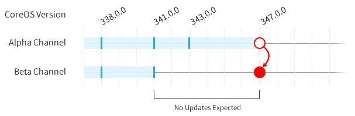

# Switching Release Channels

CoreOS is released into stable, alpha and beta channels. New features and bug fixes are tested in the alpha channel and are promoted bit-for-bit to the beta channel if no additional bugs are found.

By design, the CoreOS update engine does not execute downgrades. If you're switching from a channel with a higher CoreOS version than the new channel, your machine won't be updated again until the new channel contains a higher version number.



## Create Update Config File

You can switch machines between channels by creating `/etc/coreos/update.conf`:

```ini
GROUP=beta
```

## Restart Update Engine

The last step is to restart the update engine in order for it to pick up the changed channel:

```sh
sudo systemctl restart update-engine
```

## Debugging

After the update engine is restarted, the machine should check for an update within an hour. You can view the update engine log if you'd like to see the requests that are being made to the update service:

```sh
journalctl -f -u update-engine
```

For reference, you can find the current version:

```sh
cat /etc/os-release
```

## Release Information

You can read more about the current releases and channels on the [releases page]({{site.baseurl}}/releases).
