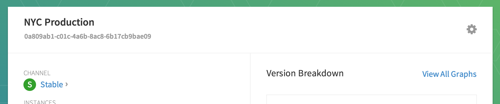

# Configure Machines to Use CoreUpdate

Configuring new or existing CoreOS machines to communicate with a [CoreUpdate](https://coreos.com/products/coreupdate) instance is a simple change to a configuration file.

## New Machines

New servers can be configured to communicate with your CoreUpdate installation by using [cloud-config](https://coreos.com/docs/cluster-management/setup/cloudinit-cloud-config).

By default, your installation has a single application, CoreOS, with the identifier `e96281a6-d1af-4bde-9a0a-97b76e56dc57`. This ID is universal and all CoreOS machines are configured to use it. Within the CoreOS application, there are several application groups which have been created to match CoreOS channels with the indentifiers `alpha`, `beta`, and `stable`.

In addition to the default groups, you may choose to create your own group that is configured to use a specific channel, rate-limit and other settings. Groups that you create will have a unique identifier that is a generated UUID or you may provide a custom string.

To place a CoreOS machine in one of these groups, you must configure the update settings via cloud-config or a file on disk.

### Join Preconfigured Group

Set the value of `server` to the custom address of your installation and append "/v1/update/". Set `group` to one of the default application groups: `alpha`, `beta`, or `stable`.

For example, here is what the Alpha group looks like in CoreUpdate:


Here's the cloud-config to use:

```
#cloud-config

coreos:
  update:
    group: alpha
    server: https://customer.update.core-os.net/v1/update/
```

### Join Custom Group

Set the value of `server` to the custom address of your installation and append "/v1/update/". Set `group` to the unique identifier of your application group.

For example, here is what "NYC Production" looks like in CoreUpdate:



Here's the cloud-config to use:

```
#cloud-config

coreos:
  update:
    group: 0a809ab1-c01c-4a6b-8ac8-6b17cb9bae09
    server: https://customer.update.core-os.net/v1/update/
```

More information can be found in the [cloud-config guide](http://coreos.com/docs/cluster-management/setup/cloudinit-cloud-config/#coreos).

## Existing Machines

To change the update of existing machines, edit `/etc/coreos/update.conf` with your favorite editor and provide the `SERVER=` and `GROUP=` values:

```
GROUP=0a809ab1-c01c-4a6b-8ac8-6b17cb9bae09
SERVER=https://customer.update.core-os.net/v1/update/
```

To apply the changes, run:

```
sudo systemctl restart update-engine
```

In addition to `GROUP=` and `SERVER=`,  a few other internal values exist, but are set to defaults. You shouldn't have to modify these.

`COREOS_RELEASE_APPID`: the CoreOS app ID, `e96281a6-d1af-4bde-9a0a-97b76e56dc57`

`COREOS_RELEASE_VERSION`: defaults to the version of CoreOS you're running

`COREOS_RELEASE_BOARD`: defaults to `amd64-usr`

## Viewing Machines in CoreUpdate

Each machine should check in about 10 minutes after boot and roughly every hour after that. If you'd like to see it sooner, you can force an update check, which will skip any rate-limiting settings that are configured.

### Force Update in Background

```
$ update_engine_client -check_for_update
[0123/220706:INFO:update_engine_client.cc(245)] Initiating update check and install.
```

### Force Update in Foreground

If you want to see what's going on behind the scenes, you can watch the ouput in the foreground:

```
$ update_engine_client -update
[0123/222449:INFO:update_engine_client.cc(245)] Initiating update check and install.
[0123/222449:INFO:update_engine_client.cc(250)] Waiting for update to complete.
LAST_CHECKED_TIME=0
PROGRESS=0.000000
CURRENT_OP=UPDATE_STATUS_IDLE
NEW_VERSION=0.0.0.0
NEW_SIZE=0
[0123/222454:ERROR:update_engine_client.cc(189)] Update failed.
```

Be aware that the "failed update" means that there isn't a newer version to install.
