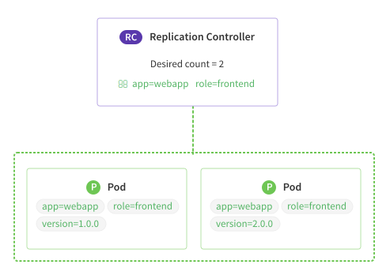

# Overview of a Replication Controller

A replication controller is one of the features of Kubernetes that you'll interact with on a regular basis to launch one or more instances of your applications. Replication controllers are "cheap" and you can have many of them configured in your cluster.

The logic of a replication controller is simple by design, but enables powerful, flexible deployment topologies for your development teams.

Each replication controller has a **desired state** that is managed by the application deployer. When a change is made to the desired state, a reconciliation loop detects this and attempts to mutate the existing state in order to match the desired state. For example, if you increase the desired instance count from 3 to 4, the replication controller would see that one new instance needs to be created and launch it somewhere on the cluster. This reconciliation process applies to any modified property of the **pod template**.

## Defining a Pod Template

In Kubernetes, the base unit of deployment is a **pod** ([intro to pods][pod-overview]), which is a group of containers that work together and therefore are logically grouped. The replication controller stores a **pod template** in order to create new pods if needed.

Like all Kubernetes features, the replication controller makes use of label queries to inspect only the pods that it is responsible for. For example, a "frontend webapp" replication controller might be responsible for all pods matching the labels `app=webapp` and `role=frontend`. The pod template should contain these labels in order for the replication controller to manage the pods that it creates.



Here's an example replication controller definition:

```yaml
apiVersion: v1
kind: ReplicationController
metadata:
  name: nginx-controller
spec:
  replicas: 2
  selector:
    role: load-balancer
  template:
    metadata:
      labels:
        role: load-balancer
    spec:
      containers:
        - name: nginx
          image: coreos/nginx
          ports:
            - containerPort: 80
```

## Examples

A common pattern for deploying a new version of an application is to create a new replication controller per deployment. Creation can be done manually by a developer or automated via the API as part of a CI/CD pipeline. Different deployment models are possible depending on your treatment of the labels on the pods created.

Both of the examples below reference another Kubernetes feature: services. Be sure to read the [intro to services][service-overview] to understand the routing and load balancing built in to Kubernetes.

### Rolling Deployment

<a href="img/rolling-deploy.svg">
  
</a>

To execute a rolling deployment without downtime you need three Kubernetes objects: a service and two replication controllers, one for version 1 and one for version 2.

The service should be configured with a fairly broad label query that will match pods created by both replication controllers, such as `app=webapp, env=prod`. Each replication controller could optionally set additional labels such as `version=X`.

The rate of the deployment is controlled by the speed at which the desired count of the version 1 replication controller is turned down, and version 2 is turned up. This process could be executed manually, or more sophisticated software could be written to monitor error rates and other metrics to influence the process or halt it altogether.

### Traffic Shift

<a href="img/traffic-shift.svg">
  
</a>

If your application requires all traffic to shift to the new version at the same time, a similar method can be used as above. The same three Kubernetes objects are used, but the sequence of events is different.

First, the service has a more specific label query that includes the version of the software running, such as `app=webapp, env=prod, version=1`. Instead of modifying the desired count of each replication controller, the version 2 controller is configured to support the same amount of load as version 1.

After all of the pods are started (and warmed if needed), the label query of the service is modifed to include version 2 instead of version 1. All traffic has now been shifted towards the new version.

An advantage of this strategy is that failing back to the old version is a simple label query modification. The elegance and flexibility of Kubernetes labels shows here. Once version 2 is confirmed to be stable, the old replication controller and pods can be terminated.

## The Reconciliation Loop in Detail

The design of the replication controller epitomizes the best practices baked into Kubernetes from Google's decade of container experience. The elegant combination of a simple infinite loop and user-provided desired state leverages the strengths of all parties involved. Developers on your team can describe what they want and let the software figure out how to best make that desire a reality.

Substantial efficiency gains are experienced as the software logic gets smarter while the humans in the loop don't even have to change their workflow. Compare this to writing an instruction set of how to turn a vanilla group of Linux machines into a working installation by executing a long set of steps in order and hoping nothing goes wrong or an important assumption hasn't changed.

### Pod Logic

The pod handling rules in the replication controller act a little differently than other cluster software. A few common scenarios are covered below:

1. When the pod template of a replication controller is updated but the replica count isn't modified, new pods will use the latest template, but existing pods won't be updated. This prevents unnecessary churn for your application. If this functionality is desired, pods can programatically be terminated via API and new pods will be started based on the updated template.

2. When a replication controller is deleted, the pods matching its label query aren't terminated. There are two reasons for this: First, the pods may still be in active rotation for a service. Second, another replication controller may have an overlapping label query and will continue to utilize the pods.

### Handling Errors

The replication controller is constantly trying to converge the existing state into the desired state. If the desired state isn't possible because of a misconfiguration, the controller will keep trying and failure events, such as invalid pull credentials, etc., will be generated.

To debug a single pod, you can change its configured labels to prevent it from matching the replication controller's label query, thus allowing you manual control to inspect or terminate it when you desire.

If the replica controller's label query doesn't overlap with the labels applied to your pods, Kubernetes will prevent the template from being saved, which will spare you from many orphaned pods from being created.

If you run out of available machines to run new pods, the pods will sit in a "pending" status until more capacity is added to the cluster.

For more information on replication controllers, the [Kubernetes documentation][upstream-rc] is the best source.

<div class="co-m-docs-next-step">
  <p><strong>Are you familiar with pods and services?</strong></p>
  <a href="services.md" class="btn btn-default">Services overview</a>
  <a href="pods.md" class="btn btn-default">Pods overview</a>
  <a href="index.html" class="btn btn-link">Back to Listing</a>
</div>

[upstream-rc]: http://kubernetes.io/v1.0/docs/user-guide/replication-controller.html
[pod-overview]: pods.md
[service-overview]: services.md
