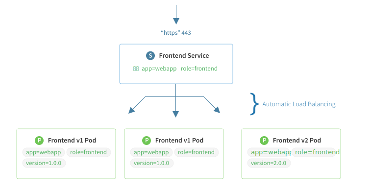
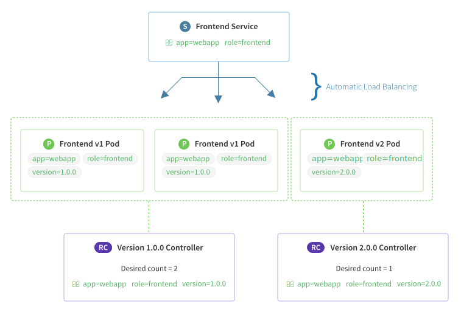
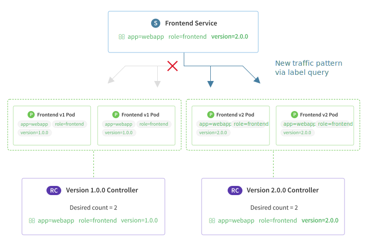

# Overview of a Service

A service is a grouping of [pods][pod-overview] that are running on the cluster. Services are "cheap" and you can have many services within the cluster. Kubernetes services can efficiently power a microservice architecture.

Services provide important features that are standardized across the cluster: load-balancing, service discovery between applications, and features to support zero-downtime application deployments.

Each service has a **pod label query** which defines the pods which will process data for the service. This label query frequently matches pods created by one or more [replication controllers][controller-overview]. Powerful routing scenarios are possible by updating a service's label query via the Kubernetes API with deployment software.

### IP Address and Routing

When creating a service, one or more **ports** can be configured. A common example would be listening on port 80 for HTTP and port 443 for HTTPS.

A core design feature of Kubernetes is a routable IP address for every service and pod in the cluster. Assigning IPs this way eliminates port conflicts between applications across the cluster. This allows any application team to bind to any port they require instead of reconfiguring databases or web servers to listen on non-standard ports.

Google learned this lesson the hard way over their decade of experience deploying this type of infrastructure. Kubernetes empowers you to avoid these mistakes before years of cruft, complexity and technical debt build up.

While this design decision complicates the networking configuraton slightly, your operations team can set up and configure [flannel][flannel], which is an open-source project designed by CoreOS to enable this type of routing for Kubernetes.

<a href="img/service.svg">
  
</a>

Here's the JSON representation of the frontend service:

```json
{
    "kind": "Service",
    "apiVersion": "v1",
    "metadata": {
        "name": "Frontend Service"
    },
    "spec": {
        "selector": {
            "app": "webapp",
            "role": "frontend"
        },
        "ports": [
            {
                "name": "https",
                "protocol": "TCP",
                "port": 443,
                "targetPort": 443
            }
        ]
    }
}
```


Let's take a closer look at some of the built-in service functionality:

## Service Discovery

Kubernetes services are designed to be a stable abstraction point between the different components of your applications. Contrast this with pods which are being created and destroyed with each software deployment or any time a service requires more capacity.

Each service has a unique IP address and a DNS hostname. Applications that consume this service can be manually configured to use either the IP address or the hostname and the traffic will be load-balanced to the correct pods. SRV-based discovery is also configured by default for all ports the service is listening on.

Keep in mind that DNS libraries used in many programming languages don't properly respect TTLs and will cache DNS lookups longer than expected. For this reason, round robin DNS isn't used unless specifically enabled. Utilizing the service's IP address will completely avoid this issue.

To do automatic service discovery, environment variables containing the IP address of each service in the cluster are injected into all containers. For example, a service named "redis-master" could be accessed from a pod by using information stored in these variables:

```sh
REDIS_MASTER_SERVICE_HOST=10.0.0.11
REDIS_MASTER_SERVICE_PORT=6379
REDIS_MASTER_PORT=tcp://10.0.0.11:6379
REDIS_MASTER_PORT_6379_TCP=tcp://10.0.0.11:6379
REDIS_MASTER_PORT_6379_TCP_PROTO=tcp
REDIS_MASTER_PORT_6379_TCP_PORT=6379
REDIS_MASTER_PORT_6379_TCP_ADDR=10.0.0.11
```

### Discovery of Resources Outside the Cluster

A service can also point to an external resource such as a cloud database or microservice that doesn't run on the Kubernetes cluster. Using a Kubernetes service to point outside the cluster allows you to execute service discovery from your pods just like a service running in the cluster. See the [upstream Kubernetes documentation][serv-without-selector] for more details.

Each application development team can choose which method (IP, DNS, etc) best matches their workflow. The important takeaway is that service discovery is standardized across the cluster and can be depended on by all users.

## Load Balancing

Services are automatically configured to load balance traffic to pods matching the label query. A random algorithm is used and is currently the only option. Session affinity can be configured to send traffic to pods by client IP.

### Health Checking Pods

Services respect the health checking parameters built into [pods][pod-overview] and traffic is only sent to pods that are healthy and started correctly.

### Disable Load Balancing via Headless Services

If your application doesn't require load-balancing or a fixed service IP, a "headless" service can be created. No load-balancing or proxying will be done for this service.

A DNS query for this service will return a list of A records that can be used by your application or custom logic to select which IP to use.

## Zero Downtime Deployments

During a deployment, new pods will be launched, running the updated version of your software. While this deployment is in progress, inbound traffic is being routed to the pods matching the service's pod label query.

Modifying this label query to be broad or specific is a flexible mechanism to point traffic towards a specific version of your application, either old or new, or send traffic to both at the same time.

Using a label query to select the pods that receive traffic is another Google design choice that comes from their container deployment experience. Maintaining a query to select pods prevents a brittle registration and removal process. Instead, pods matching the query can be constantly updated safely in an infinite loop.

Mentally compare the experience of updating a label query versus obtaining a static list of all application instances, sub-selecting the ones you care about, inspecting them to figure out if they are still valid and finally updating the load balancer with that list.

[Replication controllers][controller-overview] are used to create the pods used in your deployments. Check out the examples below for each type of deployment:

<hr />

<div class="row">
  <div class="col-lg-7 col-md-7 col-sm-12 col-xs-12">
    <a href="img/rolling-deploy.svg">
      
    </a>
  </div>
  <div class="col-lg-5 col-md-5 col-sm-12 col-xs-12">
    <h4>Rolling Deployment</h4>
    <p>Perfect for applications tolerant of running mixed version side by side.</p>
    <a href="replication-controller.md#rolling-deployment" class="btn btn-default">View Rolling Deployment docs</a>
  </div>
</div>

<hr />

<div class="row">
  <div class="col-lg-7 col-md-7 col-sm-12 col-xs-12">
    <a href="img/traffic-shift.svg">
      
    </a>
  </div>
  <div class="col-lg-5 col-md-5 col-sm-12 col-xs-12">
    <h4>Traffic Shift Deployment</h4>
    <p>Applications that need to shift all traffic at once can use this pattern.</p>
    <a href="replication-controller.md#traffic-shift" class="btn btn-default">View Traffic Shift docs</a>
  </div>
</div>

<hr />

Using Kubernetes services to expose different microservices or tiers of an application to other in your organization will accelerate your workflow and standardize important cluster-level practices: service discovery, load balancing and deployment practices.

<div class="co-m-docs-next-step">
  <p><strong>Are you familiar with pods and replication controllers?</strong></p>
  <a href="replication-controller.md" class="btn btn-default">Replication Controller overview</a>
  <a href="pods.md" class="btn btn-default">Pods overview</a>
  <a href="index.html" class="btn btn-link">Back to Listing</a>
</div>

[flannel]: https://coreos.com/flannel
[pod-overview]: pods.md
[controller-overview]: replication-controller.md
[serv-without-selector]: https://github.com/GoogleCloudPlatform/kubernetes/blob/master/docs/user-guide/services.md#services-without-selectors
