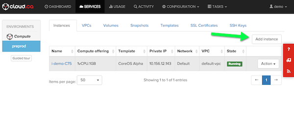
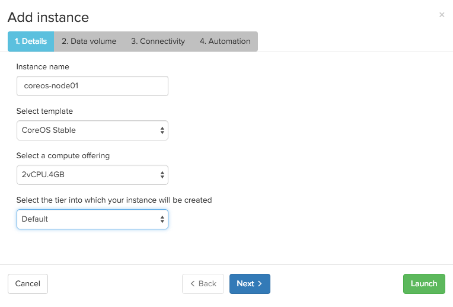
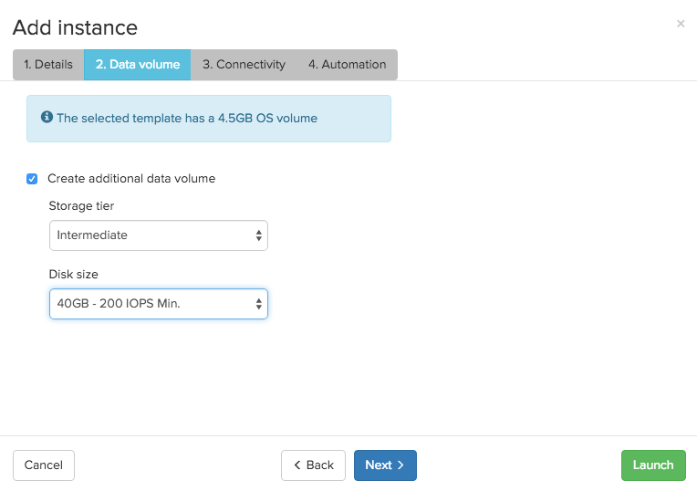
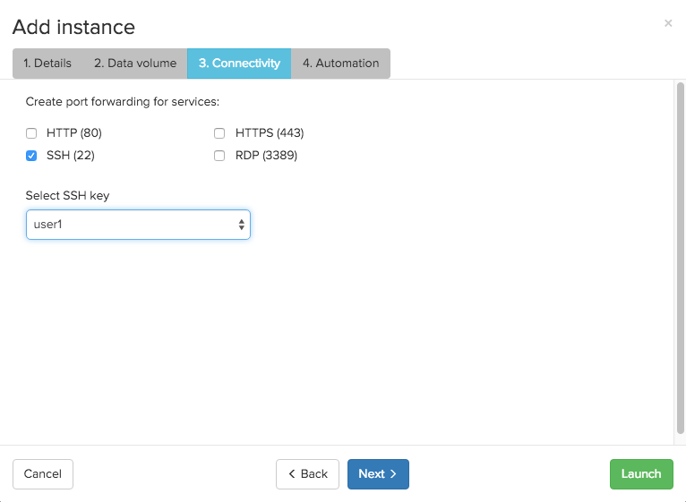
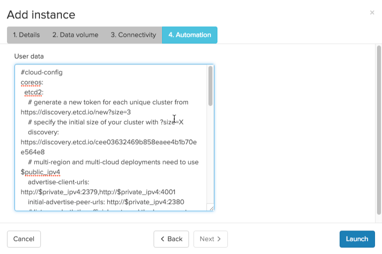
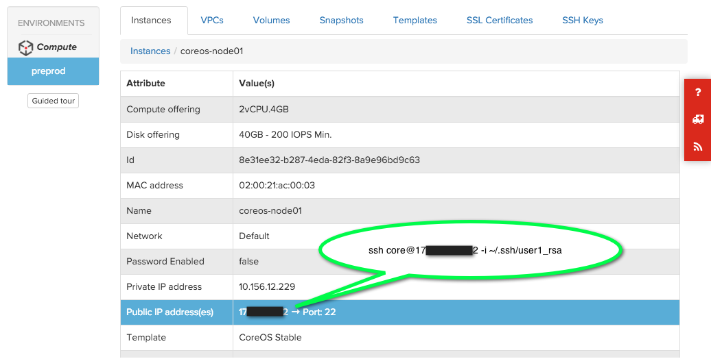

# Running CoreOS Container Linux on cloud.ca

[cloud.ca](http://www.cloud.ca) is a regional IaaS designed to help meet regulatory or security requirements by storing data in Canada. Container Linux is a supported operating system for VMs on the cloud.ca infrastructure.


## Choosing a channel

Container Linux is designed to be [updated automatically][update-docs], with three channels of different update schedules: Stable, Beta, and Alpha. You can [disable this feature][reboot-docs], although we don't recommend it. Read the [release notes][release-notes] for specific features and bug fixes.

The cloud.ca Container Linux image is built from the official stable release CloudStack image.

<div id="cca-images">
  <ul class="nav nav-tabs">
    <li class="active"><a href="#stable" data-toggle="tab">Stable Channel</a></li>
    <li><a href="#beta" data-toggle="tab">Beta Channel</a></li>
    <li><a href="#alpha" data-toggle="tab">Alpha Channel</a></li>
  </ul>
  <div class="tab-content coreos-docs-image-table">
    <div class="tab-pane" id="alpha">
      <div class="channel-info">
        <p>The Alpha channel closely tracks master and is released frequently. The newest versions of system libraries and utilities will be available for testing. The current version is Container Linux {{site.alpha-channel}}. To use the Alpha channel on cloud.ca, select the "CoreOS Stable" template and update the cloud-config to [change the channel to alpha][switching-channels]:</p>
      </div>

```cloud-config
#cloud-config
coreos:
  update:
    group: alpha
```

    </div>
    <div class="tab-pane" id="beta">
      <div class="channel-info">
        <p>The Beta channel consists of promoted Alpha releases. The current version is Container Linux {{site.beta-channel}}. To use the Beta channel on cloud.ca, use the "CoreOS Stable" template and update the cloud-config to [change the channel to beta][switching-channels]: </p>
      </div>

```cloud-config
#cloud-config
coreos:
  update:
    group: beta
```

    </div>
    <div class="tab-pane active" id="stable">
      <div class="channel-info">
        <p>The Stable channel should be used by production clusters. Versions of Container Linux are battle-tested within the Beta and Alpha channels before being promoted. The current version is Container Linux {{site.stable-channel}}.</p>
      </div>
      <table>
        <thead>
          <tr>
            <th>Region</th>
            <th>Template Name</th>
            <th>Template ID</th>
          </tr>
        </thead>
        <tbody>
          <tr>
            <td>Compute - East</td>
            <td>CoreOS Stable</td>
            <td>f3d810d8-4e08-4ffb-afe3-6a71e3ce9062</td>
          </tr>
        </tbody>
      </table>
    </div>
  </div>
</div>


## Cloud-config

Container Linux allows you to configure machine parameters, launch systemd units on startup, and more via cloud-config. Jump over to the [docs to learn about the supported features][cloud-config-docs]. Cloud-config is intended to bring up a cluster of machines into a minimal useful state and ideally shouldn't be used to configure anything that isn't standard across many hosts. Once the machine is created, cloud-config cannot be modified.

You can provide cloud-config data using cloud.ca management portal or through the CloudStack API. When using CloudStack API, the cloud-conf must be base64 encoded as the `userdata` parameter.

The current cloud-config example uses a data disk as the docker datastore (/var/lib/docker).


```cloud-config
#cloud-config
coreos:
  etcd2:
    # generate a new token for each unique cluster from https://discovery.etcd.io/new?size=3
    # specify the initial size of your cluster with ?size=X
    discovery: https://discovery.etcd.io/<token>
    # multi-region and multi-cloud deployments need to use $public_ipv4
    advertise-client-urls: http://$private_ipv4:2379,http://$private_ipv4:4001
    initial-advertise-peer-urls: http://$private_ipv4:2380
    # listen on both the official ports and the legacy ports
    # legacy ports can be omitted if your application doesn't depend on them
    listen-client-urls: http://0.0.0.0:2379,http://0.0.0.0:4001
    listen-peer-urls: http://$private_ipv4:2380
  units:
    - name: etcd2.service
      command: start
    - name: fleet.service
      command: start
    - name: format-ephemeral.service
      command: start
      content: |
        [Unit]
        Description=Formats the ephemeral drive
        [Service]
        Type=oneshot
        RemainAfterExit=yes
        ExecStart=/usr/sbin/wipefs -f /dev/xvdb
        ExecStart=/usr/sbin/mkfs.btrfs -f /dev/xvdb
    - name: var-lib-docker.mount
      command: start
      content: |
        [Unit]
        Description=Mount ephemeral to /var/lib/docker
        Requires=format-ephemeral.service
        After=format-ephemeral.service
        Before=docker.service
        [Mount]
        What=/dev/xvdb
        Where=/var/lib/docker
        Type=btrfs
```

The $public_ipv4 substitution variable is not supported in cloud-config on cloud.ca. To use a multi-region cluster, the cluster configuration and the port-forwarding must be done manually.


### Adding more machines

To add more instances to the cluster, just launch more with the same cloud-config in the same VPC. New instances will join the etcd2 cluster automatically.


## Launching instances

Before deploying Container Linux on cloud.ca, you need the following:

* An account on `https://your_organization_name.cloud.ca`.
* Access to an Environment with a running VPC. VPC and subnet creation are not
  part of the current documentation, refer to cloud.ca online help.
* Your public SSH-key added into your cloud.ca environment.


### Using cloud.ca admin portal

1. Once logged into your organization; go into Services, select your environment,
   then click "Add instance":
<div class="row">
  <div class="col-lg-8 col-md-10 col-sm-8 col-xs-12">
    
    <div class="caption">Environment instances inventory</div>
  </div>
</div>
2. Define the instance name, offering type and select the template "CoreOS Stable":
<div class="row">
  <div class="col-lg-8 col-md-10 col-sm-8 col-xs-12">
    
    <div class="caption">New instance details</div>
  </div>
</div>
3. Create a data volume. This volume will be mounted in `/var/lib/docker`, as defined in the cloud-config excerpt. This step is optional:
<div class="row">
  <div class="col-lg-8 col-md-10 col-sm-8 col-xs-12">
    
    <div class="caption">New instance data volumes</div>
  </div>
</div>
4. Enable port forwarding rule for SSH (Optional) and assign your SSH key to the new instance:
<div class="row">
  <div class="col-lg-8 col-md-10 col-sm-8 col-xs-12">
    
    <div class="caption">New instance connectivity</div>
  </div>
</div>
5. Copy your cloud-config content into the User data section (optional):
<div class="row">
  <div class="col-lg-8 col-md-10 col-sm-8 col-xs-12">
    
    <div class="caption">New instance user data</div>
  </div>
</div>
6. Once the instance is created and running, you can SSH into the instance as username **core**, using instance private IP if remote access to your VPC is configured such as remote management VPN. If you enbled port forwarding for SSH on step #4, you can find the assigned public IP in the instance details section:
<div class="row">
  <div class="col-lg-8 col-md-10 col-sm-8 col-xs-12">
    
    <div class="caption">Instance details</div>
  </div>
</div>

```sh
$ ssh -i ~/.ssh/user1_rsa core@74.X.X.X
CoreOS stable (766.4.0)
core@coreos-node01 ~ $ df -h
Filesystem      Size  Used Avail Use% Mounted on
devtmpfs        483M     0  483M   0% /dev
tmpfs           496M     0  496M   0% /dev/shm
tmpfs           496M  292K  496M   1% /run
tmpfs           496M     0  496M   0% /sys/fs/cgroup
/dev/xvda9      2.0G   19M  1.9G   1% /
/dev/xvda3      985M  390M  545M  42% /usr
/dev/xvda1      128M   32M   97M  25% /boot
tmpfs           496M     0  496M   0% /tmp
tmpfs           496M     0  496M   0% /media
/dev/xvda6      108M   80K   99M   1% /usr/share/oem
/dev/xvdb        40G   17M   38G   1% /var/lib/docker
core@coreos-node01 ~ $ etcdctl member list
7cb50ab9db389524: name=6a02cad1a70840d8a6ac2c5d3bf80aea peerURLs=http://10.151.68.222:2380 clientURLs=http://10.151.68.222:2379,http://10.151.68.222:4001
```

## Using CoreOS Container Linux

Now that you have a machine booted it is time to play around. Check out the [Container Linux Quickstart][quick-start] guide or dig into [more specific topics][docs].


[update-docs]: https://coreos.com/why/#updates
[reboot-docs]: update-strategies.md
[switching-channels]: switching-channels.md
[release-notes]: https://coreos.com/releases
[cloud-config-docs]: https://github.com/coreos/coreos-cloudinit/blob/master/Documentation/cloud-config.md
[quick-start]: quickstart.md
[docs]: https://coreos.com/docs
