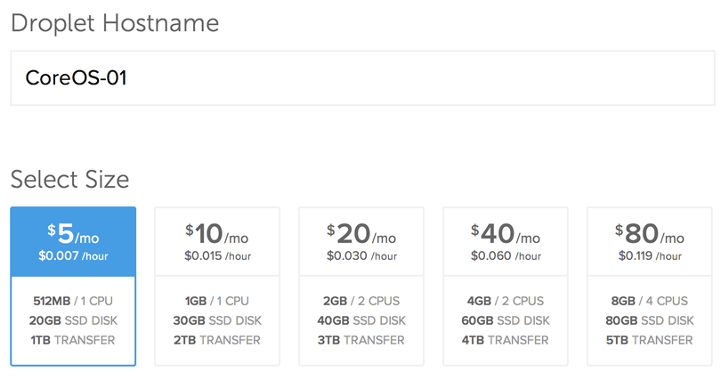
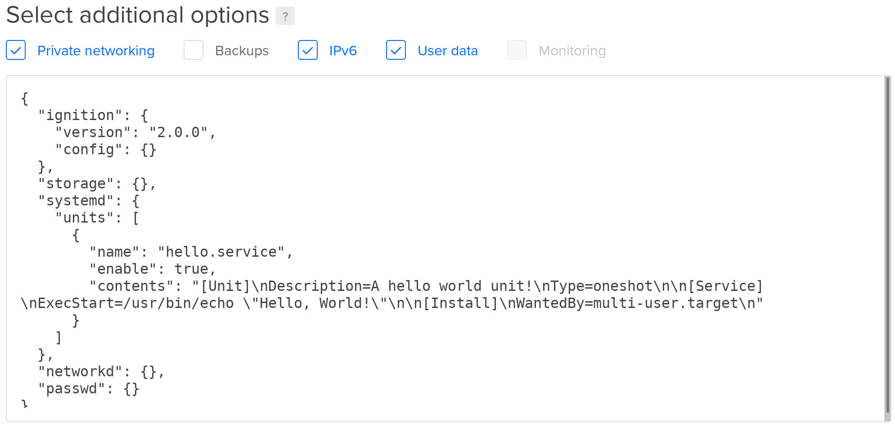
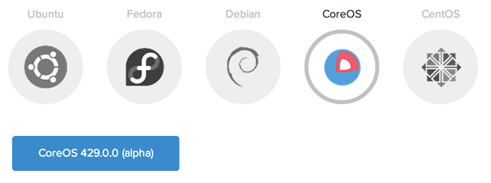

# Running CoreOS on DigitalOcean

## Choosing a channel

CoreOS is designed to be [updated automatically][update-docs] with different schedules per channel. You can [disable this feature][reboot-docs], although we don't recommend it. Read the [release notes][release-notes] for specific features and bug fixes.

The following command will create a single droplet. For more details, check out [Launching via the API](#via-the-api).

<div id="do-images">
  <ul class="nav nav-tabs">
    <li class="active"><a href="#stable" data-toggle="tab">Stable Channel</a></li>
    <li><a href="#beta" data-toggle="tab">Beta Channel</a></li>
    <li><a href="#alpha" data-toggle="tab">Alpha Channel</a></li>
  </ul>
  <div class="tab-content coreos-docs-image-table">
    <div class="tab-pane" id="alpha">
      <div class="channel-info">
        <p>The alpha channel closely tracks master and frequently has new releases. The newest versions of <a href="{{site.baseurl}}/using-coreos/docker">Docker</a>, <a href="{{site.baseurl}}/using-coreos/etcd">etcd</a>, and <a href="{{site.baseurl}}/using-coreos/clustering">fleet</a> will be available for testing. Current version is CoreOS {{site.data.alpha-channel.do-version}}.</p>
        <a href="https://cloud.digitalocean.com/droplets/new?image=coreos-alpha" class="btn btn-default">Launch CoreOS Droplet</a><br/><br/>
        <p>Launch via DigitalOcean API by specifying <code>$REGION</code>, <code>$SIZE</code> and <code>$SSH_KEY_ID</code>:</p>
        <pre>curl --request POST "https://api.digitalocean.com/v2/droplets" \
     --header "Content-Type: application/json" \
     --header "Authorization: Bearer $TOKEN" \
     --data '{"region":"'"${REGION}"'",
        "image":"{{site.data.alpha-channel.do-image-path}}",
        "size":"'"$SIZE"'",
        "user_data": "'"$(cat ~/cloud-config.yaml)"'",
        "ssh_keys":["'"$SSH_KEY_ID"'"],
        "name":"core-1"}'</pre>
      </div>
    </div>
    <div class="tab-pane" id="beta">
      <div class="channel-info">
        <p>The beta channel consists of promoted alpha releases. Current version is CoreOS {{site.data.beta-channel.do-version}}.</p>
        <a href="https://cloud.digitalocean.com/droplets/new?image=coreos-beta" class="btn btn-default">Launch CoreOS Droplet</a><br/><br/>
        <p>Launch via DigitalOcean API by specifying <code>$REGION</code>, <code>$SIZE</code> and <code>$SSH_KEY_ID</code>:</p>
        <pre>curl --request POST "https://api.digitalocean.com/v2/droplets" \
     --header "Content-Type: application/json" \
     --header "Authorization: Bearer $TOKEN" \
     --data '{"region":"'"${REGION}"'",
        "image":"{{site.data.beta-channel.do-image-path}}",
        "size":"'"$SIZE"'",
        "user_data": "'"$(cat ~/cloud-config.yaml)"'",
        "ssh_keys":["'"$SSH_KEY_ID"'"],
        "name":"core-1"}'</pre>
      </div>
    </div>
    <div class="tab-pane active" id="stable">
      <div class="channel-info">
        <div class="channel-info">
        <p>The Stable channel should be used by production clusters. Versions of CoreOS are battle-tested within the Beta and Alpha channels before being promoted. Current version is CoreOS {{site.data.stable-channel.do-version}}.</p>
        <a href="https://cloud.digitalocean.com/droplets/new?image=coreos-stable" class="btn btn-default">Launch CoreOS Droplet</a><br/><br/>
        <p>Launch via DigitalOcean API by specifying <code>$REGION</code>, <code>$SIZE</code> and <code>$SSH_KEY_ID</code>:</p>
        <pre>curl --request POST "https://api.digitalocean.com/v2/droplets" \
     --header "Content-Type: application/json" \
     --header "Authorization: Bearer $TOKEN" \
     --data '{"region":"'"${REGION}"'",
        "image":"{{site.data.stable-channel.do-image-path}}",
        "size":"'"$SIZE"'",
        "user_data": "'"$(cat ~/cloud-config.yaml)"'",
        "ssh_keys":["'"$SSH_KEY_ID"'"],
        "name":"core-1"}'</pre>
      </div>
      </div>
    </div>
  </div>
</div>

[update-docs]: https://coreos.com/why/#updates
[reboot-docs]: update-strategies.md
[release-notes]: https://coreos.com/releases

## Cloud-config

CoreOS allows you to configure machine parameters, launch systemd units on startup, and more via cloud-config. Jump over to the [docs to learn about the supported features][cloud-config-docs]. Cloud-config is intended to bring up a cluster of machines into a minimal useful state and ideally shouldn't be used to configure anything that isn't standard across many hosts. Once a droplet is created on DigitalOcean, the cloud-config cannot be modified.

You can provide raw cloud-config data to CoreOS via the DigitalOcean web console or [via the DigitalOcean API](#via-the-api).

The most common cloud-config for DigitalOcean looks like:

```yaml
#cloud-config

coreos:
  etcd2:
    # generate a new token for each unique cluster from https://discovery.etcd.io/new?size=3
    # specify the initial size of your cluster with ?size=X
    discovery: https://discovery.etcd.io/<token>
    # multi-region and multi-cloud deployments need to use $public_ipv4
    advertise-client-urls: http://$private_ipv4:2379,http://$private_ipv4:4001
    initial-advertise-peer-urls: http://$private_ipv4:2380
    # listen on both the official ports and the legacy ports
    # legacy ports can be omitted if your application doesn't depend on them
    listen-client-urls: http://0.0.0.0:2379,http://0.0.0.0:4001
    listen-peer-urls: http://$private_ipv4:2380
  units:
    - name: etcd2.service
      command: start
    - name: fleet.service
      command: start
```

The `$private_ipv4` and `$public_ipv4` substitution variables are fully supported in cloud-config on DigitalOcean. In order for `$private_ipv4` to be populated, the droplet must have "private networking" enabled. Digital Ocean private networking isn't available in all regions, and isn't actually private from others; instead, you can think of it as high-speed, free bandwidth between your droplets. etcd should be [configured with TLS][etcd-tls] when using this network to prevent others from gaining admission to, or even control of, your cluster.

[do-cloud-config]: https://developers.digitalocean.com/#droplets
[cloud-config-docs]: {{site.baseurl}}/docs/cluster-management/setup/cloudinit-cloud-config
[etcd-tls]: https://coreos.com/etcd/docs/latest/security.html#example-3-transport-security-&-client-certificates-in-a-cluster

### Adding more machines
To add more instances to the cluster, just launch more with the same cloud-config. New instances will join the cluster regardless of region.

## SSH to your droplets

CoreOS is set up to be a little more secure than other DigitalOcean images. By default, it uses the core user instead of root and doesn't use a password for authentication. You'll need to add an SSH key(s) via the web console or add keys/passwords via your cloud-config in order to log in.

To connect to a droplet after it's created, run:

```sh
ssh core@<ip address>
```

Optionally, you may want to [configure your ssh-agent](https://github.com/coreos/fleet/blob/master/Documentation/using-the-client.md#remote-fleet-access) to more easily run [fleet commands](../fleet/launching-containers-fleet.md).

## Launching droplets

### Via the API

For starters, generate a [Personal Access Token][do-token-settings] and save it in an environment variable:

```sh
read TOKEN
# Enter your Personal Access Token
```

Upload your SSH key via [DigitalOcean's API][do-keys-docs] or the web console. Retrieve the SSH key ID via the ["list all keys"][do-list-keys-docs] method:

```sh
curl --request GET "https://api.digitalocean.com/v2/account/keys" \
     --header "Authorization: Bearer $TOKEN"
```

Save the key ID from the previous command in an environment variable:

```sh
read SSH_KEY_ID
# Enter your SSH key ID
```

Create a 512MB droplet with private networking in NYC3 from the CoreOS Stable image:

```sh
curl --request POST "https://api.digitalocean.com/v2/droplets" \
     --header "Content-Type: application/json" \
     --header "Authorization: Bearer $TOKEN" \
     --data '{
      "region":"nyc3",
      "image":"{{site.data.stable-channel.do-image-path}}",
      "size":"512mb",
      "name":"core-1",
      "private_networking":true,
      "ssh_keys":['$SSH_KEY_ID'],
      "user_data": "'"$(cat cloud-config.yaml | sed 's/"/\\"/g')"'"
}'

```

For more details, check out [DigitalOcean's API documentation][do-api-docs].

[do-api-docs]: https://developers.digitalocean.com/#droplets
[do-keys-docs]: https://developers.digitalocean.com/#keys
[do-list-keys-docs]: https://developers.digitalocean.com/#list-all-keys
[do-token-settings]: https://cloud.digitalocean.com/settings/applications

### Via the web console

1. Open the ["new droplet"](https://cloud.digitalocean.com/droplets/new?image=coreos-stable) page in the web console.
2. Give the machine a hostname, select the size, and choose a region.
<div class="row">
  <div class="col-lg-8 col-md-10 col-sm-8 col-xs-12 co-m-screenshot">
    
    <div class="co-m-screenshot-caption">Choosing a size and hostname</div>
  </div>
</div>
3. Enable User Data and add your cloud-config in the text box.
<div class="row">
  <div class="col-lg-8 col-md-10 col-sm-8 col-xs-12 co-m-screenshot">
    
    <div class="co-m-screenshot-caption">Droplet settings for networking and cloud-config</div>
  </div>
</div>
4. Choose your [preferred channel](#choosing-a-channel) of CoreOS.
<div class="row">
  <div class="col-lg-8 col-md-10 col-sm-8 col-xs-12 co-m-screenshot">
    
    <div class="co-m-screenshot-caption">Choosing a CoreOS channel</div>
  </div>
</div>
5. Select your SSH keys.

Note that DigitalOcean is not able to inject a root password into CoreOS images like it does with other images. You'll need to add your keys via the web console or add keys or passwords via your cloud-config in order to log in.

## Using CoreOS

Now that you have a machine booted it is time to play around. Check out the [CoreOS Quickstart][quick-start] guide or dig into [more specific topics][docs].

[quick-start]: quickstart.md
[docs]: https://coreos.com/docs
