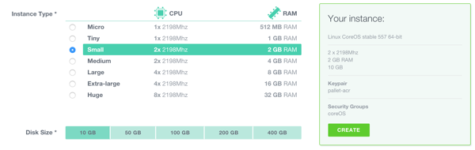

# Running CoreOS Container Linux on Exoscale

## Choosing a channel

Container Linux is designed to be [updated automatically][update-docs] with different schedules per channel. You can [disable this feature][reboot-docs], although we don't recommend it. Read the [release notes][release-notes] for specific features and bug fixes.

The Exoscale Container Linux image is built officially and each instance deployment is a unique fresh instance. By default, only the stable channel is deployed on Exoscale, you can easily [switch to Beta or Alpha channel][switching-channels].


[update-docs]: https://coreos.com/why/#updates
[reboot-docs]: update-strategies.md
[switching-channels]: switching-channels.md
[release-notes]: https://coreos.com/releases
[cloud-config-docs]: https://github.com/coreos/coreos-cloudinit/blob/master/Documentation/cloud-config.md

## Security groups

Unlike other providers, all Exoscale instances are protected by default on inbound traffic. In order to be able to work in a Container Linux cluster you should add the following rules in either your default security group or a security group of your choice and tag all Container Linux instances with it:

* SSH: TCP port 22
* etcd: TCP ports 2379 for client communication and 2380 for server-to-server communication
* etcd (Deprecated): TCP ports 4001 for client communication and 7001 for server-to-server communication


## Cloud-config

Container Linux allows you to configure machine parameters, launch systemd units on startup, and more via cloud-config. Jump over to the [docs to learn about the supported features][cloud-config-docs]. Cloud-config is intended to bring up a cluster of machines into a minimal useful state and ideally shouldn't be used to configure anything that isn't standard across many hosts. Once the machine is created, cloud-config cannot be modified.

You can provide raw cloud-config data to Container Linux via the Exoscale portal or [via the Exoscale compute API](#via-the-api).

In order to leverage Container Linux unique automation attributes, a standard CoreOS cloud-config on Exoscale could be configured with:

```yaml
#cloud-config

coreos:
  etcd2:
    # generate a new token for each unique cluster from https://discovery.etcd.io/new?size=3
    # specify the initial size of your cluster with ?size=X
    discovery: https://discovery.etcd.io/<token>
    advertise-client-urls: http://$public_ipv4:2379,http://$private_ipv4:4001
    initial-advertise-peer-urls: http://$public_ipv4:2380
    # listen on both the official ports and the legacy ports
    # legacy ports can be omitted if your application doesn't depend on them
    listen-client-urls: http://0.0.0.0:2379,http://0.0.0.0:4001
    listen-peer-urls: http://$public_ipv4:2380

  units:
    - name: etcd2.service
      command: start
    - name: fleet.service
      command: start
```

### Adding more machines

To add more instances to the cluster, just launch more with the same cloud-config adjusting the FQDN or removing the statement. New instances will join the cluster regardless of location provided that security groups are correctly configured.

### Modifying cloud-config

It is possible to modify the cloud-config contents during the lifetime of an instance. In order to modify the contents, you need to use the API command `updateVirtualMachine` with the machine in a stopped state.

```sh
cs stopVirtualMachine id=<UUID of instance>
cs updateVirtualMachine id=<UUID of instance> userData=<base64 encoded value of your cloud-config>
cs startVirtualMachine id=<UUID of instance>
```

*note:* switch the request type from GET to POST if the userData payload is longer than 2KB.

[API reference for updateVirtualMachine](https://community.exoscale.ch/compute/api/#updatevirtualmachine_GET)

## SSH to your CoreOS Container Linux instances

Container Linux does not allow root connection to the instance. By default, it uses the `core` user instead of `root` and doesn't use a password for authentication. You'll need to add an SSH key(s) via the web console or add keys/passwords via your cloud-config in order to log in.

To log in to a Container Linux instance after it's created click on its IP address or run:

```sh
ssh core@<ip address>
```

Optionally, you may want to [configure your ssh-agent](https://github.com/coreos/fleet/blob/master/Documentation/using-the-client.md#remote-fleet-access) to more easily run [fleet commands](../fleet/launching-containers-fleet.md).

## Launching instances

### Via the API

Install and configure the command line client (Python required) with your [API details](https://portal.exoscale.ch/account/profile/api).

```sh
pip install cs
vi $HOME/.cloudstack.ini
[cloudstack]
endpoint = https://api.exoscale.ch/compute
key = api key
secret = secret
```

To launch a Small 2GB instance with the current Stable Container Linux image:

note: template ids are available on the [Exoscale website](https://www.exoscale.ch/open-cloud/templates/).

```sh
cs deployVirtualMachine templateId=2a196b89-0c50-4400-9d42-ef43bcc0fa99 serviceOfferingId=21624abb-764e-4def-81d7-9fc54b5957fb zoneId=1128bd56-b4d9-4ac6-a7b9-c715b187ce11 keyPair=[keypair name]
```

Be sure to specify your SSH key to be able to access the machine. Management of SSH keys is detailed on the [SSH key page][exo-keys-docs]. For more details, check out [Exoscale's API documentation][exo-api-docs].

[exo-api-docs]: https://community.exoscale.ch/compute/api/
[exo-keys-docs]: https://community.exoscale.ch/compute/documentation/#SSH_keypairs

### Via the web console

1. Open the ["add new instance"](https://portal.exoscale.ch/compute/instances/add) page in the Exoscale web portal.
2. Give the machine a hostname, and choose a zone.
3. Choose the Container Linux template
<div class="row">
  <div class="col-lg-8 col-md-10 col-sm-8 col-xs-12">
    
    <div class="caption">Choosing Exoscale template</div>
  </div>
</div>
4. Choose the instance size
<div class="row">
  <div class="col-lg-8 col-md-10 col-sm-8 col-xs-12">
    
    <div class="caption">Choosing Exoscale instance size</div>
  </div>
</div>
5. Select your SSH keys.
6. Add your your optional cloud-config.
<div class="row">
  <div class="col-lg-8 col-md-10 col-sm-8 col-xs-12">
    
    <div class="caption">Exoscale cloud-config</div>
  </div>
</div>
7. Create your instance

Unlike other Exoscale images where the root password is randomly set at startup, Container Linux does not have password logon activated. You will need to [configure your public key with Exoscale][exo-keys-docs] in order to login to the Container Linux instances or to specify external keys using cloud-config.

## Using CoreOS Container Linux

Now that you have a machine booted it is time to play around. Check out the [Container Linux Quickstart][quick-start] guide or dig into [more specific topics][docs].

[quick-start]: quickstart.md
[docs]: https://coreos.com/docs
