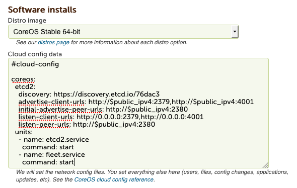

# Running CoreOS Container Linux on RimuHosting's LaunchtimeVPS service

RimuHosting's LaunchtimeVPS service provides hosted virtual machines, and provides Container Linux as one of their standard images. Customers can launch these VMs via the web interface or via the RimuHosting server management API.

## About the RimuHosting CoreOS Container Linux setup

RimuHosting automatically creates the systemd networking files (no need to put networking setup in the cloud init block).

The provided image is from the Container Linux `stable` channel and is updated with each stable release.

RimuHosting uses the Container Linux PXE kernel and initrd (stored on your VM at `/boot`). We boot up the VM via pv-grub (so the kernel used is provided by Container Linux, not the Xen-based VM host).

### Public SSH keys

The Container Linux default user is named `core`, and password authentication and root logins are both disabled. You'll need to add an SSH key(s) via the web interface or add keys/passwords via your cloud-config in order to log in.

Ensure you have set your [SSH public keys][rh-ssh-keys-page]. If you do not have a RimuHosting account, use the register link.

This process will set the RimuHosting SSH key on the core and root user as well as adding your own SSH keys. You can override this if you do not wish us to have access, via the cloudinit `ssh-authorized-keys` or `write_files` declarations.

### Gotchas

The cloud-config file is placed at `/var/lib/coreos-install/user_data`. It runs on each server start. If you do not want the actions to be repeated at each server start, remove the file as part of the cloudinit process.

### Cloud-config

You provide raw cloud-config data to Container Linux as part of the web interface install process or via the [RimuHosting API][rh-api-docs] command line install method.

The `$private_ipv4` and `$public_ipv4` substitution variables are fully supported in cloud-config on RimuHosting. In order for `$private_ipv4` to be populated, the VM must have private networking enabled.

## Launching VMs

### Via the web interface

1. Ensure you have set your [SSH public keys][rh-ssh-keys-page]. If you do not have a RimuHosting account, use the register link.
2. Configure a [new VM][rh-variable-plan-page] (including memory, disk size and data center. Start the order.
2. In the Software installs section select the Container Linux image (currently only the stable channel is provided). Tab away from that field to reveal the cloud config input field. Then provide your cloud config.
<div class="row">
  <div class="col-lg-8 col-md-10 col-sm-8 col-xs-12 co-m-screenshot">
    <a href="rimuhosting-coreos-image-select-cloud-config.png">
      
    </a>
    <div class="co-m-screenshot-caption">Choosing the Container Linux image and providing a cloud config.</div>
  </div>
</div>
4. Start the install. The server will be setup and you will be notified when that is complete.

A VM can be reinstalled (with a fresh/clean Container Linux image and different cloud-config) via the [reinstall interface][rh-reinstall-page].

### Via the API

Set your public [SSH keys][rh-ssh-keys-page].

git clone --depth 1 the [Python driver for the RimuHosting API][rh-python-driver-api]:

```sh
git clone --depth 1 git@github.com:pbkwee/RimuHostingAPI.git
```

Install the library:

```
python3 setup.py build install
```

If you do not already have a server with us, you will need to email RimuHosting and ask them to enable automated server setups on your account.

Get a [server management API key][rh-api-keys-page]

Set the API key as an environment variable:

```sh
export RIMUHOSTING_APIKEY=00000000123456789
```

Or set the key in a `.rimuhosting` config file:

```sh
echo "export RIMUHOSTING_APIKEY=00000000123456789" >> ~/.rimuhosting
```

Edit the server spec at `sample-configs/unmodified/servers/server.json` e.g.

```json
{
  "vps_parameters": {
    "disk_space_mb": "8192",
    "memory_mb": "4096"
  },
  "instantiation_options": {
    "distro": "coreos.64",
    "domain_name": "coreos-master.example.com"
  }
}
```

Edit the cloud config data you want to use at `sample-configs/defaults/cloud-init/master.yaml`.

Create the Container Linux VM:

```sh
$ python3 mkvm.py --server_json sample-configs/unmodified/servers/server.json \
--cloud_config sample-configs/defaults/cloud-init/master.yaml
```

For more details, check out [RimuHosting's API documentation][rh-api-docs].

### Adding more machines

To add more instances to the cluster, just launch more with the same cloud-config. New instances will join the cluster regardless of VM location.

### SSH to your VM

To connect to a VM after it's created (VM creation may take up to a couple of minutes), run:

```sh
ssh core@<ip address>
```

Optionally, you may want to [configure your ssh-agent](https://github.com/coreos/fleet/blob/master/Documentation/using-the-client.md#remote-fleet-access) to more easily run [fleet commands](../fleet/launching-containers-fleet.md).

## Using CoreOS Container Linux

Now that you have a cluster bootstrapped it is time to play around. Check out the [Container Linux quickstart guide](quickstart.md) or dig into [more specific topics](https://coreos.com/docs).

[rh-api-docs]: http://apidocs.rimuhosting.com/jaxrsdocs/index.html
[rh-ssh-keys-page]: https://launchtimevps.com/cp/sshkeys.jsp
[rh-variable-plan-page]: https://launchtimevps.com/#variable_plan
[rh-reinstall-page]: https://rimuhosting.com/cp/vps/disk/install.jsp
[rh-api-keys-page]: https://rimuhosting.com/cp/apikeys.jsp
[rh-python-driver-api]: https://github.com/pbkwee/RimuHostingAPI
