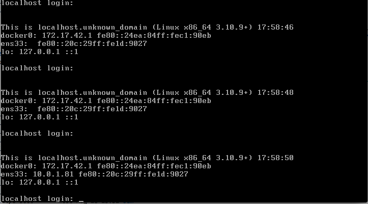

# Running CoreOS Container Linux on VMware

These instructions walk through running Container Linux on VMware Fusion or ESXi. If you are familiar with another VMware product, you can use these instructions as a starting point.

## Running the VM

### Choosing a channel

Container Linux is designed to be [updated automatically](https://coreos.com/why/#updates) with different schedules per channel. You can [disable this feature](update-strategies.md), although we don't recommend it. Read the [release notes](https://coreos.com/releases) for specific features and bug fixes.

<div id="vmware-images">
  <ul class="nav nav-tabs">
    <li class="active"><a href="#stable" data-toggle="tab">Stable Channel</a></li>
    <li><a href="#beta" data-toggle="tab">Beta Channel</a></li>
    <li><a href="#alpha" data-toggle="tab">Alpha Channel</a></li>
  </ul>
  <div class="tab-content coreos-docs-image-table">
    <div class="tab-pane active" id="stable">
      <div class="channel-info">
        <p>The Stable channel should be used by production clusters. Versions of Container Linux are battle-tested within the Beta and Alpha channels before being promoted. The current version is Container Linux {{site.stable-channel}}.</p>
       </div>
      <pre>curl -LO https://stable.release.core-os.net/amd64-usr/current/coreos_production_vmware_ova.ova</pre>
    </div>
    <div class="tab-pane" id="alpha">
      <div class="channel-info">
        <p>The Alpha channel closely tracks master and is released frequently. The newest versions of system libraries and utilities will be available for testing. The current version is Container Linux {{site.alpha-channel}}.</p>
      </div>
      <pre>curl -LO https://alpha.release.core-os.net/amd64-usr/current/coreos_production_vmware_ova.ova</pre>
    </div>
    <div class="tab-pane" id="beta">
      <div class="channel-info">
        <p>The Beta channel consists of promoted Alpha releases. The current version is Container Linux {{site.beta-channel}}.</p>
      </div>
      <pre>curl -LO https://beta.release.core-os.net/amd64-usr/current/coreos_production_vmware_ova.ova</pre>
    </div>
  </div>
</div>

### Booting with VMware ESXi

Use the vSphere Client to deploy the VM as follows:

1. In the menu, click `File` > `Deploy OVF Template...`
2. In the wizard, specify the location of the OVA file downloaded earlier
3. Name your VM
4. Choose "thin provision" for the disk format
5. Choose your network settings
6. Confirm the settings, then click "Finish"

Uncheck `Power on after deployment` in order to edit the VM before booting it the first time.

The last step uploads the files to the ESXi datastore and registers the new VM. You can now tweak VM settings, then power it on.

*NB: These instructions were tested with an ESXi v5.5 host.*

### Booting with VMware Workstation 12 or VMware Fusion

Run VMware Workstation GUI:

1. In the menu, click `File` > `Open...`
2. In the wizard, specify the location of the OVA template downloaded earlier
3. Name your VM, then click `Import`
4. (Press `Retry` *if* VMware Workstation raises an "OVF specification" warning)
5. Edit VM settings if necessary
6. [Modify the `.vmx` file][guestinfo] to pass an Ignition config containing at least one valid SSH key
7. Start your Container Linux VM

*NB: These instructions were tested with a Fusion 8.1 host.*

### Installing via PXE or ISO image

Container Linux can also be installed by booting the virtual machine via [PXE][PXE] or the [ISO image][ISO] and then [installing Container Linux to disk][install].

## Container Linux Configs

Container Linux allows you to configure machine parameters, configure networking, launch systemd units on startup, and more via Container Linux Configs. These configs are then transpiled into Ignition configs and given to booting machines. Head over to the [docs to learn about the supported features][cl-configs].

You can provide a raw Ignition config to Container Linux via VMware's [Guestinfo interface][guestinfo].

As an example, this config will start etcd:

```yaml container-linux-config
etcd:
  # All options get passed as command line flags to etcd.
  # Any information inside curly braces comes from the machine at boot time.

  # vmware isn't currently supported for dynamic data, so we can't use {PRIVATE_IPV4}
  advertise_client_urls:       "http://10.0.0.10:2379"
  initial_advertise_peer_urls: "http://10.0.0.10:2380"
  # listen on both the official ports and the legacy ports
  # legacy ports can be omitted if your application doesn't depend on them
  listen_client_urls:          "http://0.0.0.0:2379"
  listen_peer_urls:            "http://10.0.0.10:2380"
  # generate a new token for each unique cluster from https://discovery.etcd.io/new?size=3
  # specify the initial size of your cluster with ?size=X
  discovery:                   "https://discovery.etcd.io/<token>"
```

[cl-configs]: provisioning.md

## VMware Guestinfo interface

### Setting Guestinfo options

The VMware guestinfo interface is a mechanism for VM configuration. Guestinfo properties are stored in the VMX file, or in the VMX representation in host memory. These properties are available to the VM at boot time. Within the VMX, the names of these properties are prefixed with `guestinfo.`. Guestinfo settings can be injected into VMs in one of four ways:

* Configure guestinfo in the OVF for deployment. Software like [vcloud director][vcloud director] manipulates OVF descriptors for guest configuration. For details, check out this VMware blog post about [Self-Configuration and the OVF Environment][ovf-selfconfig].

* Set guestinfo keys and values from the Container Linux guest itself, by using a VMware Tools command like:

```sh
/usr/share/oem/bin/vmtoolsd --cmd "info-set guestinfo.<variable> <value>"
```

* Guestinfo keys and values can be set from a VMware Service Console, using the `setguestinfo` subcommand:

```sh
vmware-cmd /vmfs/volumes/[...]/<VMNAME>/<VMNAME>.vmx setguestinfo guestinfo.<property> <value>
```

* You can manually modify the VMX and reload it on the VMware Workstation, ESXi host, or in vCenter.

Guestinfo configuration set via the VMware API or with `vmtoolsd` from within the Container Linux guest itself are stored in VM process memory and are lost on VM shutdown or reboot.

### Defining the Ignition config in Guestinfo

If the `guestinfo.coreos.config.data` property is set, Ignition will apply the referenced config on first boot.

The Ignition config is prepared for the guestinfo facility in one of two encoding types, specified in the `guestinfo.coreos.config.data.encoding` variable:

|    Encoding    |                        Command                        |
|:---------------|:------------------------------------------------------|
| &lt;elided&gt; | `sed -e 's/%/%%/g' -e 's/"/%22/g' /path/to/user_data` |
| base64         | `base64 -w0 /path/to/user_data && echo`               |

#### Example

```
guestinfo.coreos.config.data = "ewogICJpZ25pdGlvbiI6IHsgInZlcnNpb24iOiAiMi4wLjAiIH0KfQo="
guestinfo.coreos.config.data.encoding = "base64"
```

This example will be decoded into:

```json ignition-config
{
  "ignition": { "version": "2.0.0" }
}
```

## Logging in

Networking can take some time to start under VMware. Once it does, press enter a few times at the login prompt and you should see an IP address printed on the console:



In this case the IP is `10.0.1.81`.

Now you can login to the host at that IP using your SSH key, or the password set in your cloud-config:

```sh
ssh core@10.0.1.81
```

Alternatively, appending `coreos.autologin` to the kernel parameters at boot causes the console to accept the `core` user's login with no password. This is handy for debugging.

## Using CoreOS Container Linux

Now that you have a machine booted, it's time to explore. Check out the [Container Linux Quickstart][quickstart] guide, or dig into [more specific topics][docs].

[quickstart]: quickstart.md
[docs]: https://github.com/coreos/docs
[PXE]: booting-with-pxe.md
[ISO]: booting-with-iso.md
[install]: installing-to-disk.md
[vcloud director]: http://blogs.vmware.com/vsphere/2012/06/leveraging-vapp-vm-custom-properties-in-vcloud-director.html
[ovf-selfconfig]: http://blogs.vmware.com/vapp/2009/07/selfconfiguration-and-the-ovf-environment.html
[guestinfo]: #vmware-guestinfo-interface
