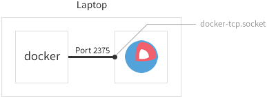
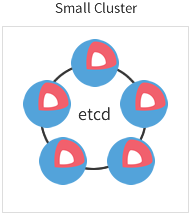
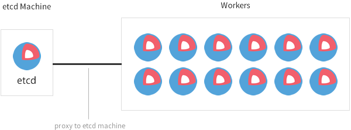
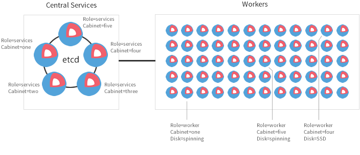

# CoreOS Container Linux cluster architectures

## Overview

Depending on the size of your cluster and how it's going to be used, there are a few common cluster architectures that can be followed. These are described below.

Most of these scenarios set aside a few machines dedicated to running central cluster services, such as etcd and the distributed controllers for applications like Kubernetes, Mesos, and OpenStack. Separating out these services into a few known machines allows you to make sure they are distributed across cabinets/availability zones and easily set up static networking to allow for easy bootstrapping. If you're worried about relying on the discovery service, this architecture will remove your worries.

The cloud-config files provided with each section are valid, but you will need to add SSH keys and other desired configuration options.

## Docker dev environment on laptop


<div class="caption">Laptop development environment with Container Linux VM</div>

| Cost | Great For | Set Up Time | Production |
|------|-----------|-------------|------------|
| Low | Laptop development | Minutes | No |

If you're developing locally but plan to run containers in production, it helps to mirror that environment locally. This can easily be done by running Docker commands on your laptop that control a Container Linux VM in VMware Fusion or VirtualBox.

### Configuring your laptop

Start a single Container Linux VM with the Docker remote socket enabled in the cloud-config. Once it's running, tell your local Docker binary to use the remote port by exporting an environment variable and start running Docker commands:

```
$ export DOCKER_HOST=tcp://localhost:2375
$ docker ps
```

Here's what the cloud-config looks like:

```cloud-config
#cloud-config

coreos:
  units:
    - name: docker-tcp.socket
      command: start
      enable: yes
      content: |
        [Unit]
        Description=Docker Socket for the API

        [Socket]
        ListenStream=2375
        BindIPv6Only=both
        Service=docker.service

        [Install]
        WantedBy=sockets.target
    - name: enable-docker-tcp.service
      command: start
      content: |
        [Unit]
        Description=Enable the Docker Socket for the API

        [Service]
        Type=oneshot
        ExecStart=/usr/bin/systemctl enable docker-tcp.socket
```

## Small cluster


<div class="caption">Small Container Linux cluster running etcd on all machines</div>

| Cost | Great For | Set Up Time | Production |
|------|-----------|-------------|------------|
| Low | Small clusters, trying out Container Linux | Minutes | Yes |

For small clusters between 3-9 machines, running etcd on all of the machines allows for high availability without paying for extra machines that just run etcd.

Getting started is easy &mdash; a single cloud-config can be used to start all machines on a cloud-provider.

### Configuring the machines

Following the guide for each of the [supported platforms](https://coreos.com/docs#running-coreos) will be the easiest way to get started with this architecture. Boot the desired number of machines with the same cloud-config and discovery token. The cloud-config specifies that etcd and fleet will be started on each machine.

## Easy development/testing cluster


<div class="caption">Container Linux cluster optimized for development and testing</div>

| Cost | Great For | Set Up Time | Production |
|------|-----------|-------------|------------|
| Low | Development/Testing | Minutes | No |

When you're first getting started with Container Linux, it's common to frequently tweak your cloud-config which requires booting/rebooting/destroying many machines. Instead of being slowed down and distracted by generating new discovery URLs and bootstrapping etcd, it's easier to start a single etcd node.

You are now free to boot as many machines as you'd like as test workers that read from the etcd node. All the features of fleet, Locksmith, and etcdctl will continue to work properly, but will connect to the etcd node instead of using a local etcd instance. Since etcd isn't running on all of the machines, you'll gain a little bit of extra CPU and RAM to play with.

This environment is now set up to take a beating. Pull the plug on a machine and watch fleet reschedule the units, max out the CPU, etc.

### Configuration for etcd role

Since we're only using a single etcd node, there is no need to include a discovery token. There isn't any high availability for etcd in this configuration, but that's assumed to be OK for development and testing. Boot this machine first so you can configure the rest with its IP address, which is specified with the network unit.

The network unit is typically used for bare metal installations that require static networking. If you're using a cloud-provider, you can omit the network unit and use DHCP and the `$private_ipv4` and `$public_ipv4` variables on platforms that support this. Check the documentation for your specific provider for examples.

Here's the cloud-config for the etcd machine:

```cloud-config
#cloud-config

coreos:
  etcd2:
    name: etcdserver
    initial-cluster: etcdserver=http://10.0.0.101:2380
    initial-advertise-peer-urls: http://10.0.0.101:2380
    advertise-client-urls: http://10.0.0.101:2379
    # listen on both the official ports and the legacy ports
    # legacy ports can be omitted if your application doesn't depend on them
    listen-client-urls: http://0.0.0.0:2379,http://0.0.0.0:4001
    listen-peer-urls: http://0.0.0.0:2380
  units:
    - name: etcd2.service
      command: start
    - name: 00-eth0.network
      runtime: true
      content: |
        [Match]
        Name=eth0

        [Network]
        DNS=1.2.3.4
        Address=10.0.0.101/24
        Gateway=10.0.0.1
```

### Configuration for worker role

This architecture allows you to boot any number of workers, as few as 1 or up to a large cluster for load testing. The notable configuration difference for this role is specifying that fleet should use our etcd proxy instead of starting etcd server locally.

Look how simple the cloud-config becomes:

```cloud-config
#cloud-config

coreos:
  etcd2:
    proxy: on
    listen-client-urls: http://localhost:2379
    initial-cluster: etcdserver=http://10.0.0.101:2380
  fleet:
    etcd_servers: "http://localhost:2379"
  units:
    - name: etcd2.service
      command: start
    - name: fleet.service
      command: start
```

## Production cluster with central services


<div class="caption">Container Linux cluster separated into central services and workers.</div>

| Cost | Great For | Set Up Time | Production |
|------|-----------|-------------|------------|
| High | Large bare-metal installations | Hours | Yes |

For large clusters, it's recommended to set aside 3-5 machines to run central services. Once those are set up, you can boot as many workers as your heart desires. Each of the workers will use the distributed etcd cluster on the central machines via local etcd proxies.

fleet will be used to bootstrap both the central services and jobs on the worker machines by taking advantage of machine metadata and global units.

### Configuration for central services role

Our Central Services machines will run services that support the rest of the cluster. etcd is configured with static networking and a peers list.

If you're using a cloud-provider, you can omit the network unit and use DHCP and the `$private_ipv4` and `$public_ipv4` variables on platforms that support this. Check the documentation for your specific provider for examples.

fleet will be started with metadata indicating the role of these machines, which allows us to schedule global units that will only run on these machines with `Global=true` and `MachineMetadata=role=services`. Optionally, set additional machine metadata for availability zones, cabinet number, location, etc. to ensure that each central service machine is distributed correctly across your infrastructure.

[Managed Linux](https://coreos.com/products/managed-linux) customers can also specify a [CoreUpdate](https://coreos.com/products/coreupdate) group ID which will allow you to attach these machines to a different channel and control updates separately from the worker machines.

Here's an example cloud-config for one of the central service machines. Be sure to generate a new discovery token with the initial size of your cluster:

```cloud-config
#cloud-config

coreos:
  etcd2:
    # generate a new token for each unique cluster from https://discovery.etcd.io/new?size=3
    # specify the initial size of your cluster with ?size=X
    discovery: https://discovery.etcd.io/<token>
    # multi-region and multi-cloud deployments need to use $public_ipv4
    advertise-client-urls: http://10.0.0.101:2379
    initial-advertise-peer-urls: http://10.0.0.101:2380
    # listen on both the official ports and the legacy ports
    # legacy ports can be omitted if your application doesn't depend on them
    listen-client-urls: http://0.0.0.0:2379,http://0.0.0.0:4001
    listen-peer-urls: http://10.0.0.101:2380
  fleet:
    metadata: "role=services,cabinet=one"
  update:
    # CoreUpdate group ID for "Production Central Services"
    group: 9e98ecae-4623-48c1-9679-423549c44da6
    server: https://customer.update.core-os.net/v1/update/
  units:
    - name: etcd2.service
      command: start
    - name: fleet.service
      command: start
    - name: 00-eth0.network
      runtime: true
      content: |
        [Match]
        Name=eth0

        [Network]
        DNS=1.2.3.4
        Address=10.0.0.101/24
        Gateway=10.0.0.1
```

### Configuration for worker role

The worker roles will use DHCP and should be easy to add capacity or autoscaling.

Similar to the central services machines, fleet will be configured with metadata specifying the role and any additional metadata you wish to set. etcd will automatically fallback to a local proxy via discovery service.If not all machines have SSDs or you have a subset of machines with a ton of RAM, it's useful to set metadata for those attributes.

[Managed Linux](https://coreos.com/products/managed-linux) customers can also specify a [CoreUpdate](https://coreos.com/products/coreupdate) group ID to use a different channel and control updates separately from the central machines.

Here's an example cloud-config for a worker:

```cloud-config
#cloud-config

coreos:
  etcd2:
    # use the same discovery token for the central service machines
    # make sure you have used the discovery token to bootstrap the
    # central service successfully
    # this etcd will fallback to proxy automatically
    discovery: https://discovery.etcd.io/<token>
    # listen on both the official ports and the legacy ports
    # legacy ports can be omitted if your application doesn't depend on them
    listen-client-urls: http://0.0.0.0:2379,http://0.0.0.0:4001
  fleet:
    metadata: "role=worker,cabinet=two,disk=spinning"
    etcd_servers: "http://localhost:2379"
  locksmith:
    endpoint: "http://localhost:2379"
  units:
    - name: etcd2.service
      command: start
    - name: fleet.service
      command: start
  update:
    # CoreUpdate group ID for "Production Workers"
    group: f118a298-2a8a-460b-9edd-3a9b49df504e
    server: https://customer.update.core-os.net/v1/update/
```
