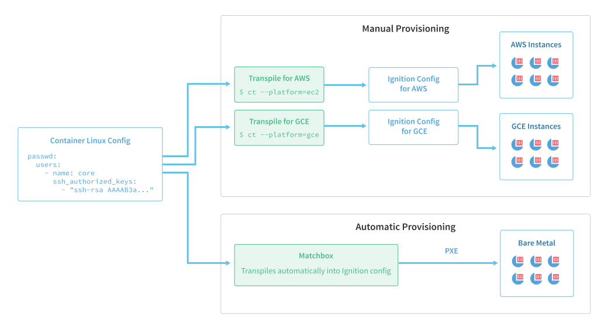

# Provisioning

Container Linux automates machine provisioning with a specialized system for applying initial configuration. This system implements a process of (trans)compilation and validation for machine configs, and an atomic service to apply validated configurations to machines.

## Container Linux Config

Container Linux admins define these configurations in a format called the [Container Linux Config][clc], which is specific to Container Linux, structured as YAML, and intended to be human-readable. The Container Linux Config has features devoted to configuring Container Linux services such as [etcd][etcd], [rkt][rkt], Docker, [flannel][flannel], and [locksmith][locksmith]. The defining feature of the config is that it cannot be sent directly to a Container Linux provisioning target. Instead, it is first validated and transformed into a machine-readable and wire-efficient form.

The following examples demonstrate the simplicity of the Container Linux Config format.

This extremely simple Container Linux Config will fetch and run the current release of etcd:

```yaml container-linux-config:norender
etcd:
```

Extend the definition to specify the version of etcd to run. The following example will provision a new Container Linux machine to fetch and run the etcd service, version 3.1.6:

```yaml container-linux-config:norender
etcd:
  version: 3.1.6
```

Use variable replacement to configure the etcd service with the provisioning target's public and private IPv4 addresses, making it repeatable across a group of machines.

```yaml container-linux-config:norender
etcd:
  advertise_client_urls:       http://{PUBLIC_IPV4}:2379
  initial_advertise_peer_urls: http://{PRIVATE_IPV4}:2380
  listen_client_urls:          http://0.0.0.0:2379
  listen_peer_urls:            http://{PRIVATE_IPV4}:2380
  discovery:                   https://discovery.etcd.io/<token>
```

`PUBLIC_IPV4` and `PRIVATE_IPV4` are automatically populated from the environment in which Container Linux runs, if this metadata exists. Given the many different environments in which Container Linux can run, it's difficult if not impossible to accurately determine these variables in every instance. Be certain to check this value as a troubleshooting measure.

For example, the default metadata for an EC2 environment would be used: `public_ipv4` and `local_ipv4`. On Azure, *either* the virtual IP or public IP could be used for the `PUBLIC_IPV4` (`ct` makes a best guess and uses the virtual IP, but this could change in the future), and the dynamic IP would be used for the `PRIVATE_IPV4`. On bare metal, this information cannot be reliably derived in a general manner, so these variables cannot be used.

Because variable expansion is unpredictable and complex, and because it is also common for users to inadvertently write invalid configs, the use of a transformation tool is strongly encouraged. The default tool recommended for this task is the [Config Transpiler][ct] (ct for short). The Config Transpiler will validate and transform a Container Linux Config into the format that Container Linux can consume: the Ignition Config.

## Ignition Config

Ignition, the utility in Container Linux responsible for provisioning the machine, fetches and executes the Ignition Config. Container Linux directly consumes the Ignition Config configuration format.

Ignition Configs are mostly static, distro-agnostic, and meant to be generated by a machine rather than a human. While they can be written directly by users, it is highly discouraged due to the ease with which errors may be introduced. Rather than writing Ignition Configs directly, users are encouraged to use provisioning tools like [Matchbox][matchbox], which transparently translate Container Linux Configs to Ignition Configs, or to use the Config Transpiler itself.



As shown in this diagram, `ct` is manually invoked only when users are manually provisioning machines. If a provisioning tool like Matchbox is used, `ct` will transparently be incorporated into the deployment pipeline. In which case, the user only needs to prepare a Container Linux Config - Ignition and the Ignition Config are merely an implementation detail.

## Config Transpiler

The Container Linux Config Transpiler abstracts the details of configuring Container Linux. It's responsible for transforming a Container Linux Config written by a user into an Ignition Config to be consumed by instances of Container Linux.

The Container Linux Config Transpiler command line interface, `ct` for short, can be downloaded from its [GitHub Releases page][download-ct].

The following config will configure an etcd cluster using the machine's public and private IP addresses:

```yaml container-linux-config:norender
etcd:
  advertise_client_urls:       http://{PUBLIC_IPV4}:2379
  initial_advertise_peer_urls: http://{PRIVATE_IPV4}:2380
  listen_client_urls:          http://0.0.0.0:2379
  listen_peer_urls:            http://{PRIVATE_IPV4}:2380
  discovery:                   https://discovery.etcd.io/<token>
```

As suggested earlier, `ct` requires information about the target environment before it can transform configs which use templating. If this config is passed to `ct` without any other arguments, `ct` fails with the following error message:

```
$ ct < example.yml
error: platform must be specified to use templating
```

This message states that because the config takes advantage of templating (in this case,  `PUBLIC_IPV4`), `ct` must be invoked with the `--platform` argument. This extra information is used by `ct` to make the platform-specific customizations necessary. Keeping the Container Linux Config and the invocation arguments separate allows the Container Linux Config to remain largely platform independent.

CT can be invoked again and given Amazon EC2 as an example:

```
$ ct --platform=ec2 < example.yml
{"ignition":{"version":"2.0.0","config"...
```

This time, `ct` successfully runs and produces the following Ignition Config:

```ignition-config
{
  "ignition": { "version": "2.0.0" },
  "systemd": {
    "units": [{
      "name": "etcd-member.service",
      "enable": true,
      "dropins": [{
        "name": "20-clct-etcd-member.conf",
        "contents": "[Unit]\nRequires=coreos-metadata.service\nAfter=coreos-metadata.service\n\n[Service]\nEnvironmentFile=/run/metadata/coreos\nExecStart=\nExecStart=/usr/lib/coreos/etcd-wrapper $ETCD_OPTS \\\n  --listen-peer-urls=\"http://${COREOS_EC2_IPV4_LOCAL}:2380\" \\\n  --listen-client-urls=\"http://0.0.0.0:2379\" \\\n  --initial-advertise-peer-urls=\"http://${COREOS_EC2_IPV4_LOCAL}:2380\" \\\n  --advertise-client-urls=\"http://${COREOS_EC2_IPV4_PUBLIC}:2379\" \\\n  --discovery=\"https://discovery.etcd.io/\u003ctoken\u003e\""
      }]
    }]
  }
}
```

This Ignition Config enables and configures etcd as specified in the above Container Linux Config. This can be more easily seen if the contents of the etcd drop-in are formatted nicely:

```ini
[Unit]
Requires=coreos-metadata.service
After=coreos-metadata.service

[Service]
EnvironmentFile=/run/metadata/coreos
ExecStart=
ExecStart=/usr/lib/coreos/etcd-wrapper $ETCD_OPTS \
  --listen-peer-urls="http://${COREOS_EC2_IPV4_LOCAL}:2380" \
  --listen-client-urls="http://0.0.0.0:2379" \
  --initial-advertise-peer-urls="http://${COREOS_EC2_IPV4_LOCAL}:2380" \
  --advertise-client-urls="http://${COREOS_EC2_IPV4_PUBLIC}:2379" \
  --discovery="https://discovery.etcd.io/<token>"
```

The details of these changes are covered in depth in Ignition's [metadata documentation][metadata], but the gist is that `coreos-metadata` is used to fetch the IP addresses from the Amazon APIs and then `systemd` is leveraged to substitute the IP addresses into the invocation of etcd. The result is that even though Ignition only runs once, `coreos-metadata` fetches the IP addresses whenever etcd is run, allowing etcd to use IP addresses that have the potential to change.

## Migrating from cloud configs

Previously, the recommended way to provision a Container Linux machine was with a cloud-config. These configs would be given to a Container Linux machine and a utility called [coreos-cloudinit][cloudinit] would read this file and apply the configuration on every boot.

For a [number of reasons][vs], coreos-cloudinit has been deprecated in favor of Container Linux Configs and Ignition. For help migrating from these legacy cloud-configs to Container Linux Configs, refer to the [migration guide][migrating].

## Using Container Linux Configs

Now that the basics of Container Linux Configs have been covered, a good next step is to read through the [examples][examples] and start experimenting. The [troubleshooting guide][troubleshooting] is a good reference for debugging issues.

[clc]: https://github.com/coreos/container-linux-config-transpiler/blob/master/doc/configuration.md
[cloudinit]: https://github.com/coreos/coreos-cloudinit
[ct]: https://github.com/coreos/container-linux-config-transpiler/blob/master/doc/overview.md
[download-ct]: https://github.com/coreos/container-linux-config-transpiler/releases
[etcd]: https://github.com/coreos/etcd
[examples]: https://github.com/coreos/container-linux-config-transpiler/blob/master/doc/examples.md
[flannel]: https://github.com/coreos/flannel
[locksmith]: https://github.com/coreos/locksmith
[matchbox]: https://github.com/coreos/matchbox
[metadata]: ../ignition/metadata.md
[migrating]: migrating-to-clcs.md
[rkt]: https://github.com/rkt/rkt
[troubleshooting]: https://github.com/coreos/ignition/blob/master/doc/getting-started.md#troubleshooting
[vs]: ../ignition/what-is-ignition.md#ignition-vs-coreos-cloudinit
