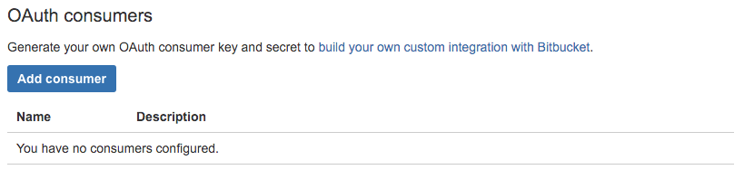
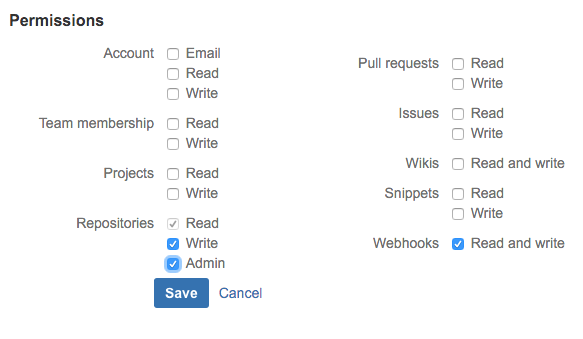
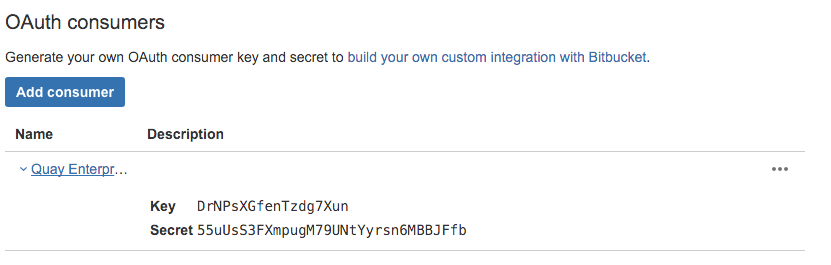

# Creating an OAuth Application in BitBucket

This document describes how to authenticate Quay Enterprise users with their [BitBucket][bitbucket] identities.

## Add OAuth Consumer

- Log into BitBucket
- Visit the Settings page for your organization
- Click the "OAuth" tab under "Access Management"
- Click the Add Consumer button:

## Configure the Callback URL

Next, configure BitBucket to redirect you back to your Quay Enterprise upon a successful login:

- Enter the Quay Enterprise URL as the `URL`
- Enter `https://{REGISTRY URL HERE}/oauth2/bitbucket/callback` as the `Callback URL`.
- Grant permissions on the repositories and webhooks:

- Save the application
- Record the Key and Secret shown in the new entry in the list of OAuth consumers after saving the application:

## Return to Quay Enterprise setup

Return to the Quay Enterprise setup tool to enter the Key and Secret recorded above, and complete the setup procedure.

[bitbucket]:https://bitbucket.org

<!-- BEGIN ANALYTICS -->  <!-- END ANALYTICS -->