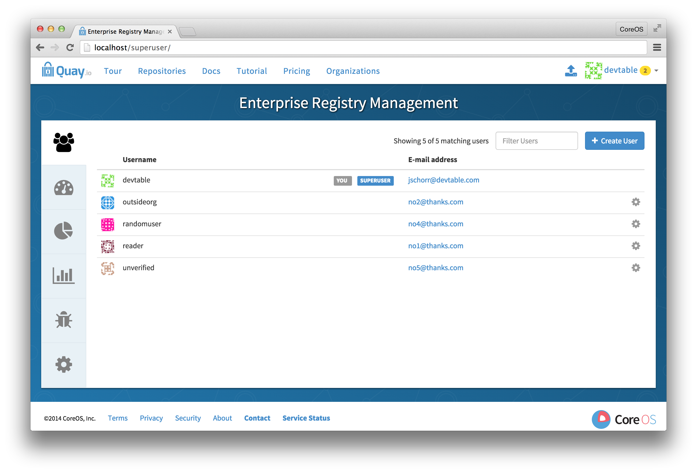
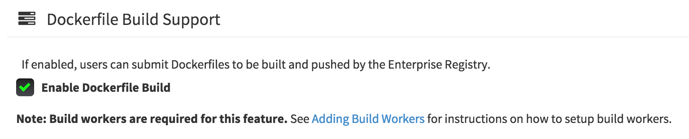
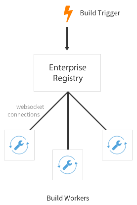

# Automatically build Dockerfiles with build workers

CoreOS Enterprise Registry supports building Dockerfiles using a set of worker nodes. Build triggers, such as GitHub webhooks ([Setup Instructions](github-build.md)), can be configured to automatically build new versions of your repositories when new code is committed. This document will walk you through enabling the feature flag and setting up multiple build workers to enable this feature.

*Note:* This feature is currently in *beta*, so it may encounter issues every so often. Please report any issues encountered to support so we can fix it ASAP.

## Visit the management panel

Sign in to a super user account and visit `http://yourregister/superuser` to view the management panel:



## Enable Building



- Click the configuration tab (<span class="fa fa-gear"></span>) and scroll down to the section entitled **Dockerfile Build Support**.
- Check the "Enable Dockerfile Build" box
- Click "Save Configuration Changes"
- Restart the container (you will be prompted)

## Setup the build workers



One or more build workers will communicate with the main registry container to build new containers when triggered. The machines must have Docker installed and must not be used for any other work. The following procedure needs to be done every time a new worker needs to be added, but it can be automated fairly easily.

### Pull the build worker image

The build worker is currently in beta. To gain access to its repository, please contact support.
Once given access, pull down the latest copy of the image just like any other:

```sh
docker pull quay.io/coreos/registry-build-worker:v1.16.4
```

### Run the build worker image

Run this container on each build worker. Since the worker will be orchestrating docker builds, we need to mount in the docker socket. This orchestration will use a large amount of CPU and need to manipulate the docker images on disk &mdash; we recommend that dedicated machines be used for this task.

Use the environment variable `SERVER` to tell the worker how to communicate with the primary Enterprise Registry container. A websocket is used as a data channel, and it was configured when we changed the feature flag above.

| Security | Websocket Address |
|----------|-------------------|
| Using SSL | ```wss://somehost.com``` |
| Without SSL | ```ws://somehost.com``` |

Here's what the full command looks like:

```sh
docker run --restart on-failure -e SERVER=wss://myenterprise.host -v /var/run/docker.sock:/var/run/docker.sock quay.io/coreos/registry-build-worker:v1.16.4
```

When the container starts, each build worker will auto-register with the Enterprise Registry and start building containers once a job triggered and it is assigned to a worker.

### Setup GitHub build (optional)

If your organization plans to have builds be conducted via pushes to GitHub (or GitHub Enterprise), please continue
with the [Setting up GitHub Build](github-build.md).
