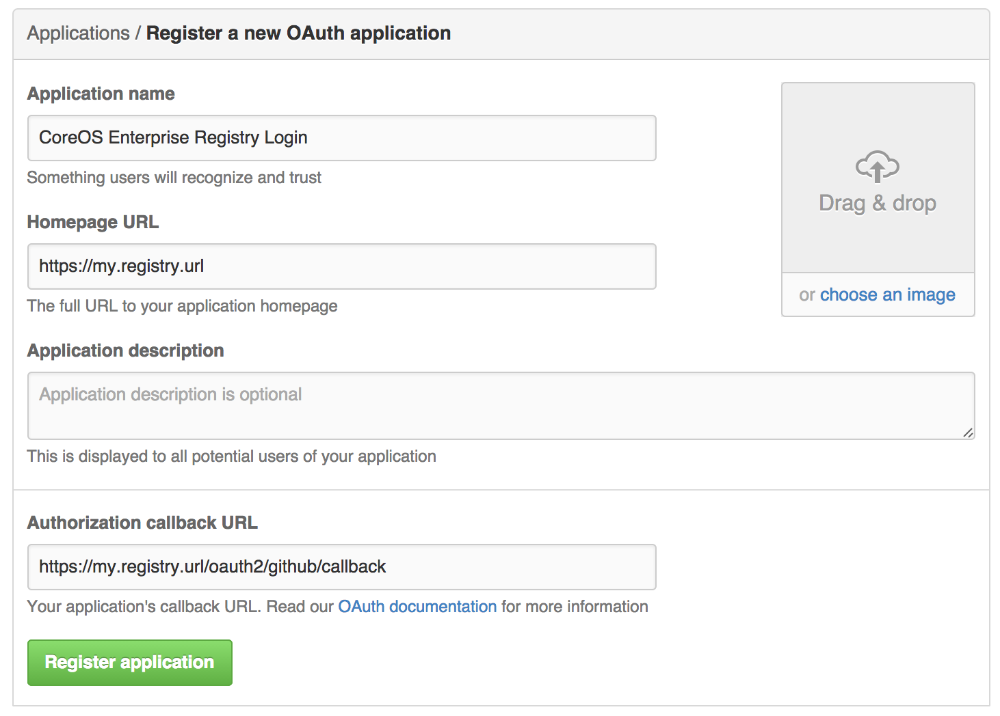
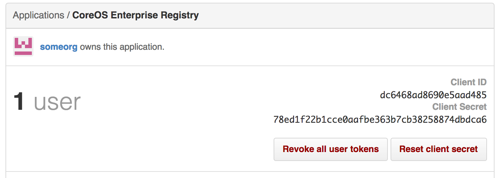

# Creating an OAuth application in GitHub

- Log into GitHub (Enterprise)
- Visit the applications page under your organization's settings and click "[Register New Application](https://github.com/settings/applications/new)".

- Enter your registry's URL as the application URL

Note: If using public GitHub, the URL entered must be accessible by *your users*. It can still be an internal URL.

- Enter `https://{REGISTRY URL HERE}/oauth2/github/callback` as the Authorization callback URL.
- Create the application

- Note down the `Client ID` and `Client Secret`.
