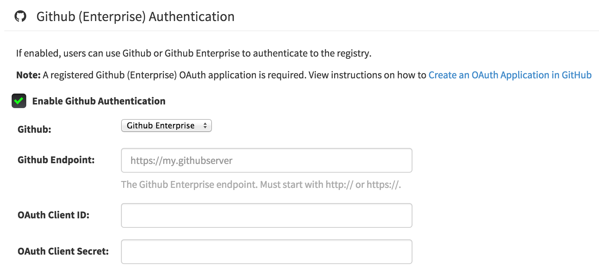

# GitHub Authentication

CoreOS Enterprise Registry supports using GitHub or GitHub Enterprise as an authentication system.

## Create an OAuth Application in GitHub

Following the instructions at [Create a GitHub Application](github-app.md).

**NOTE:** This application must be **different** from that used for GitHub Build Triggers.

## Visit the Management Panel

Sign in to a super user account and visit `http://yourregister/superuser` to view the management panel:

## Enable GitHub Authentication

- Click the configuration tab () and scroll down to the section entitled <strong> GitHub (Enterprise) Authentication</strong>.
- Check the "Enable GitHub Authentication" box
- Fill in the credentials from the application created above
- Click "Save Configuration Changes"
- Restart the container (you will be prompted)
