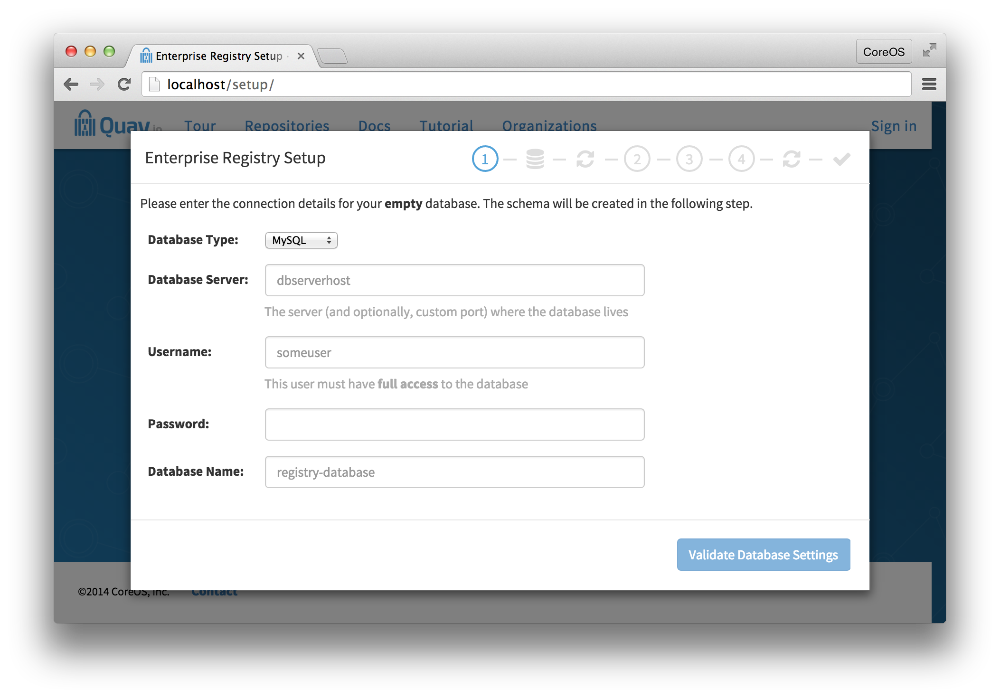
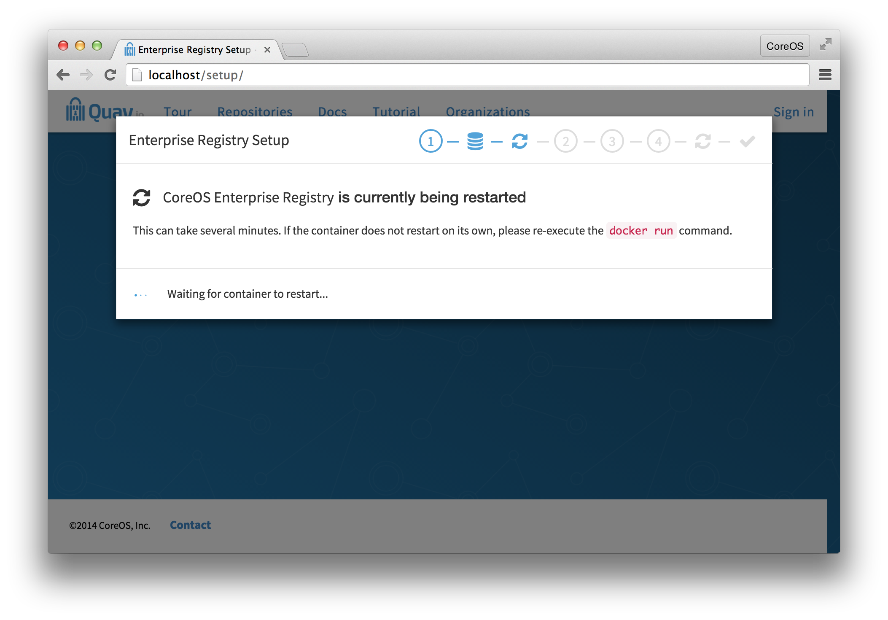

# On-premises installation

Quay Enterprise requires three components to be running to begin the setup process:

- A supported database (MySQL, Postgres)
- A Redis instance (for real-time events)
- The Quay Enterprise image

**NOTE**: Please have the host and port of the database and the Redis instance ready.

## Downloading your license

A valid license is required to run Quay Enterprise. Your license can be found on [Tectonic Accounts](https://account.tectonic.com). Please download or copy this license in **Raw Format** as a file named `license`.

## Preparing the database

A MySQL RDBMS or Postgres installation with an empty database is required, and a login with full access to said database. The schema will be created the first time the registry image is run. The database install can either be pre-existing or run on CoreOS via a [Docker container](mysql-container.md).

## Setting up redis

Redis stores data which must be accessed quickly but doesn’t necessarily require durability guarantees. If you have an existing Redis instance, make sure to accept incoming connections on port 6379 (or change the port in the setup process) and then feel free to skip this step.

To run redis, simply pull and run the Quay.io Redis image:

```
sudo docker pull quay.io/quay/redis
sudo docker run -d -p 6379:6379 quay.io/quay/redis
```

**NOTE**: This host will have to accept incoming connections on port 6379 from the hosts on which the registry will run.

## Downloading the Quay Enterprise image

After signing up you will be able to download a pull secret that you can rename to `config.json`.

The file will look like this:

```
{
  "auths": {
    "quay.io": {
      "auth": "abcdefghijklmnopqrstuvwxyz...",
      "email": ""
    }
  }
}
```

This file contains your credentials to the `quay.io/coreos/quay` repository. Save this file to your CoreOS machine in `/home/core/.docker/config.json` and `/root/.docker/config.json`. You should now be able to execute `docker pull quay.io/coreos/quay:v2.0.1` to download the container.

## Setting up the directories

Quay Enterprise requires a storage directory and a configuration directory:

```
mkdir storage
mkdir config
```

## Setting up and running the registry

Run the following command, replacing `/local/path/to/the/config/directory` and `/local/path/to/the/storage/directory` with the absolute paths to the directories created above:

```
sudo docker run --restart=always -p 443:443 -p 80:80 --privileged=true -v /local/path/to/the/config/directory:/conf/stack -v /local/path/to/the/storage/directory:/datastorage -d quay.io/coreos/quay:v2.0.1
```



Once started, visit: http://yourhost/setup, wait for the page to load (it may take a minute or two) and follow instructions there to setup Quay Enterprise.

**NOTE**: Quay Enterprise will restart itself a few times during this setup process. If the container does not automatically come
back up, simply run the command above again.




## Verifying the status of QE

Visit the `/health/endtoend` endpoint on the Quay Enterprise hostname and verify that the `code` is `200` and `is_testing` is `false`.


## Logging in

### If using database authentication:

Once Quay Enterprise is running, new users can be created by clicking the `Sign Up` button. If e-mail is enabled, the sign up process will require an e-mail confirmation step, after which repositories, organizations and teams can be setup by the user.


### If using LDAP authentication:

Users should be able to login to the Quay Enterprise directly with their LDAP username and password.
