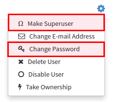

# LDAP Authentication Setup for Quay Enterprise

The Lightweight Directory Access Protocol (LDAP) is an open, vendor-neutral, industry standard application protocol for accessing and maintaining distributed directory information services over an Internet Protocol (IP) network. Quay Enterprise supports using LDAP as an identity provider.

## Before you start

The Quay Enterprise LDAP setup workflow requires that the user configuring the LDAP Setup to exist in LDAP directory. Before attempting the setup, make sure that you are logged in as a superuser that matches user crendentials in LDAP. In order to do so, Navigate to the SuperUser panel (ex: http(s)://quay.enterprise/superuser) and click on “Create User” button to create a new User. Make sure to create a user that matches username/email syntax in LDAP. 

Once the user is created, click on the Settings icon next to the user and choose “Make Superuser” option. For ease of troubleshooting, set the User password to LDAP password. 

 

You will be prompted to restart the container once the new user is created. Restart Quay Enterprise container and log in to the Superuser panel ***as the user that was just created.*** 

## Setup LDAP Configuration

Navigate to the Superuser panel and navigate to settings section. Locate the Authentication section and select “LDAP” from the drop-down menu. 

Enter LDAP configuration fields as required.

### Few tips for LDAP configuration:

- LDAP URI must be in ldap:// or ldaps:// syntax. Typing a URI with ldaps:// prefix will surface the option to provide custom SSL certificate for TLS setup
- User Relative DN is relative to BaseDN (ex: ou=NYC not ou=NYC,dc=example,dc=org)
- Logged in Username must exist in User Relative DN
- You can enter multiple “Secondary User Relative DNs” if there are multiple Organizational Units where User objects are located at. (ex: ou=Users,ou=NYC and ou=Users,ou=SFO). Simply type in the Organizational Units and click on Add button to add multiple RDNs
- sAMAccountName is the UID attribute for against Microsoft Active Directory setups
- Quay Enterprise searches "User Relative DN" with subtree scope. For example, if your Organization has Organizational Units NYC and SFO under the Users OU (`ou=SFO,ou=Users and ou=NYC,ou=Users`), Quay Enterprise can authenticate users from both the NYC and SFO Organizational Units if the User Relative DN is set to Users (ou=Users)

Once the configuration is completed, click on “Save Configuration Changes” button. You will be prompted to login with ***LDAP credentials***. 

## Common Issues

***Invalid credentials*** 

Administrator DN or Administrator DN Password values are incorrect

***Verification of superuser %USERNAME% failed: Username not found The user either does not exist in the remote authentication system OR LDAP auth is misconfigured.***

Quay can connect to the LDAP server via Username/Password specified in the Administrator DN fields however cannot find the current logged in user with the UID Attribute or Mail Attribute fields in the User Relative DN Path. Either current logged in user does not exist in User Relative DN Path, or Administrator DN user do not have rights to search/read this LDAP path.
