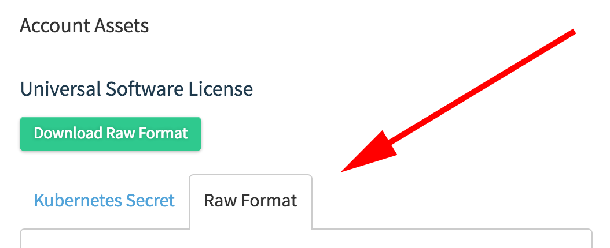

# Upgrade to Quay Enterprise 2

All Quay Enterprise instances being upgraded from versions < 2.0.0 **must** upgrade to Quay Enterprise 2.0.0 first before continuing to upgrade. This upgrade has an extra step, documented here.

We **highly** recommend performing this upgrade during a scheduled maintainence window, as it will require taking the existing cluster down temporarily.

## Download Quay Enterprise License

To begin, download your Quay Enterprise License from your [Tectonic Account](https://account.tectonic.com). Please download or copy this license in **Raw Format** as a file named `license`:



## Shutdown all Quay Enterprise instances

Shutdown all running instances of Quay Enterprise, across all clusters.

## Run a single instance of Quay Enterprise 2

Run a single instance of Quay Enterprise 2.0.0 by replacing `quay.io/coreos/registry:{currentVersion}` with `quay.io/coreos/quay:v2.0.0` in your run command, startup script, config or systemd unit.

## Add your license to the Quay Enterprise

### Quay Enterprise setup as a container or under Kubernetes

- Visit the management panel:

Sign in to a super user account and visit `http://yourregister/superuser` to view the management panel:


- Click the configuration tab (<span class="fa fa-gear"></span>)
- In the section entitled "License", paste in the contents of the license downloaded above
- Click "Save Configuration Changes"
- Restart the container (you will be prompted)

### Add license via the filesystem

Ensure QE instance has been shutdown and add the raw format license in `license` file to the directory mapped to `conf/stack`, next to the existing `config.yaml`.

#### Example:

`conf/stack` is mapped to `quay2/config` in `docker run` command used to bring up Quay Enterprise: 
```
docker run --restart=always -p 443:443 -p 80:80 --privileged=true -v /quay2/config:/conf/stack -v /quay2/storage:/datastorage -d quay.io/coreos/quay:v2.0.0
```

`license` file resides in the `quay2/config` directory:
```
$ ls quay2/config/
config.yaml  license

$ cat quay2/license
eyJhbGciOiJSUzI1NiJ9.eyJzY2hlbWFWZXJzaW9uIjoidjIiLCJ2ZXJzaW9uIjoiMSIsImNyZWF0aW9uRGF0ZSI6IjIwMTYtMTAtMjZUMTc6MjM6MjJaIiwiZXhwaXJ
[...]
```

## Update cluster

Update all remaining Quay Enterprise instances to refer to the new image (`quay.io/coreos/quay:v2.0.0`).

## Verify cluster

Verify that your cluster and its license are valid by performing a push or pull. If you receive an HTTP `402`, please make sure your license is properly installed and valid by checking in the management panel (see above for instructions).

If you encounter unusual problems, please contact support.
