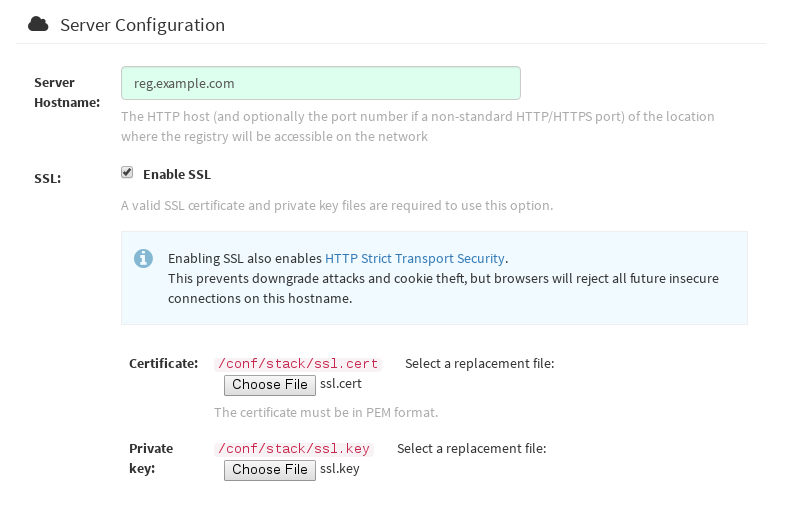
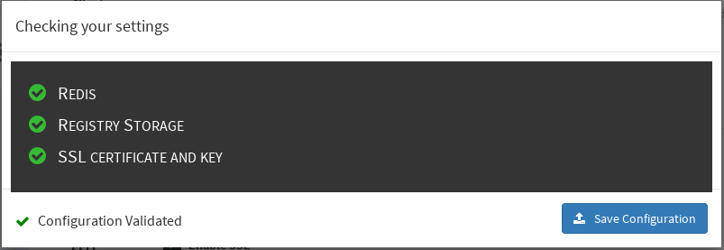
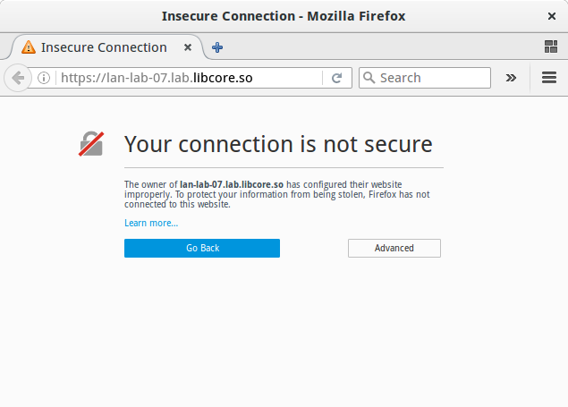

# Using SSL to protect connections to Quay Enterprise

This document assumes you have deployed [Quay Enterprise as a single container][qe-single].

Quay Enterprise will be configured with a [self-signed certificate][self-signed-cert]. A Certificate Authority (CA) is required.

## Create a CA and sign a certificate

First, create a root CA:

```
$ openssl genrsa -out rootCA.key 2048
$ openssl req -x509 -new -nodes -key rootCA.key -sha256 -days 1024 -out rootCA.pem
```

Next, create an `openssl.cnf` file. Replacing `DNS.1` and `IP.1` with the hostname and IP of the Quay Enterprise server:

`openssl.cnf `

```
[req]
req_extensions = v3_req
distinguished_name = req_distinguished_name
[req_distinguished_name]
[ v3_req ]
basicConstraints = CA:FALSE
keyUsage = nonRepudiation, digitalSignature, keyEncipherment
subjectAltName = @alt_names
[alt_names]
DNS.1 = reg.example.com
IP.1 = 12.345.678.9
```

The following set of shell commands invoke the `openssl` utility to create a key for Quay Enterprise, generate a request for an Authority to sign a new certificate, and finally generate a certificate for Quay Enterprise, signed by the CA created earlier.

Make sure the CA certificate file `rootCA.pem` and the `openssl.cnf` config file are both available.

```
$ openssl genrsa -out ssl.key 2048
$ openssl req -new -key ssl.key -out ssl.csr -subj "/CN=quay-enterprise" -config openssl.cnf
$ openssl x509 -req -in ssl.csr -CA rootCA.pem -CAkey rootCA.key -CAcreateserial -out ssl.cert -days 356 -extensions v3_req -extfile openssl.cnf
```

## Configuring Quay Enterprise to use the new certificate

The next step can be accomplished either in the QE superuser panel, or from the terminal.

### To configure with the superuser GUI in QE

Set the `Server Hostname` to the appropriate value and check the `Enable SSL` then upload the `ssl.key` and `ssl.cert` files:



Save the configuration. QE will automatically validate the SSL certificate.



Restart the container:


### To configure with the command line

By not using the web interface the configuration checking mechanism built into QE is unavailable. It is suggested to use the web interface if possible.

Copy the `ssl.key` and `ssl.cert` into the specified `config` directory.

**Note: The certificate/key files must be named ssl.key and ssl.cert**

```
$ ls
ssl.cert  ssl.key
$ scp ssl.* core@10.7.8.117:/home/core/config/

core@lan-lab-7 ~ $ ls config/
config.yaml  ssl.cert  ssl.key
```

Modify the `PREFERRED_URL_SCHEME:` parameter in config.yaml from `http` to `https`

```
PREFERRED_URL_SCHEME: https
```

Restart the QE container:

```
$ docker ps
CONTAINER ID        IMAGE                     COMMAND                  CREATED             STATUS              PORTS                                                NAMES
eaf45a4aa12d        quay.io/quay/redis        "/usr/bin/redis-serve"   22 hours ago        Up 22 hours         0.0.0.0:6379->6379/tcp                               dreamy_ramanujan
cbe7b0fa39d8        quay.io/coreos/quay   "/sbin/my_init"          22 hours ago        Up About an hour    0.0.0.0:80->80/tcp, 0.0.0.0:443->443/tcp, 8443/tcp   fervent_ptolemy
705fe7311940        mysql:5.7                 "/entrypoint.sh mysql"   23 hours ago        Up 22 hours         0.0.0.0:3306->3306/tcp                               mysql

$ docker restart cbe7b0fa39d8
```

### Test the secure connection

Confirm the configuration by visiting the URL from a browser `https://reg.example.com/`




"Your Connection is not secure" means the CA is untrusted but confirms that SSL is functioning properly. Check Google for how to configure your operating system and web browser to trust your new CA.


## Configuring Docker to Trust a Certificate Authority

Docker requires that custom certs be installed to `/etc/docker/certs.d/` under a directory with the same name as the hostname private registry. It is also required for the cert to be called `ca.crt`

Copying the rootCA file.

```
$ cp tmp/rootCA.pem /etc/docker/certs.d/reg.example.com/ca.crt`
```

After this step is completed `docker login` should authenticate successfully and pushing to the repository should succeed.

```
$ sudo docker push reg.example.com/kbrwn/hello
The push refers to a repository [reg.example.com/kbrwn/hello]
5f70bf18a086: Layer already exists
e493e9cb9dac: Pushed
1770dbc4af14: Pushed
a7bb4eb71da7: Pushed
9fad7adcbd46: Pushed
2cec07a74a9f: Pushed
f342e0a3e445: Pushed
b12f995330bb: Pushed
2016366cdd69: Pushed
a930437ab3a5: Pushed
15eb0f73cd14: Pushed
latest: digest: sha256:c24be6d92b0a4e2bb8a8cc7c9bd044278d6abdf31534729b1660a485b1cd315c size: 7864
```


[qe-single]: https://tectonic.com/quay-enterprise/docs/latest/initial-setup.html
[self-signed-cert]: https://en.wikipedia.org/wiki/Self-signed_certificate
