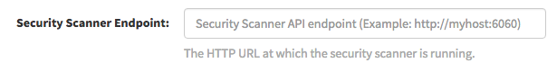
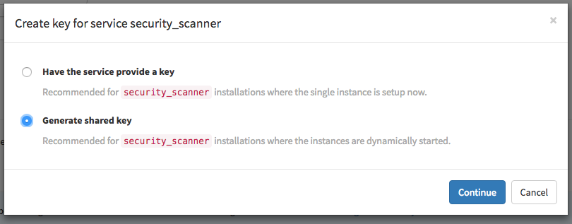
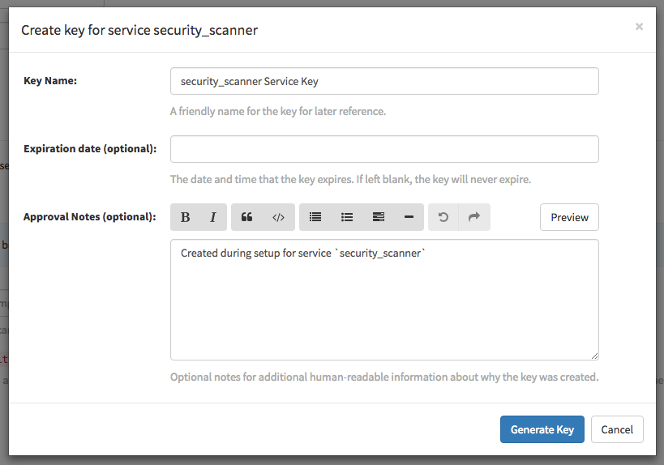
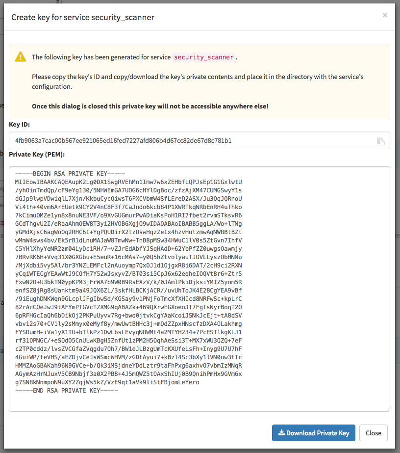
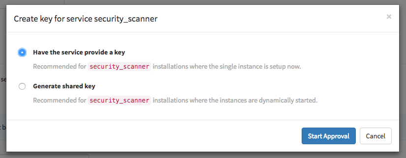
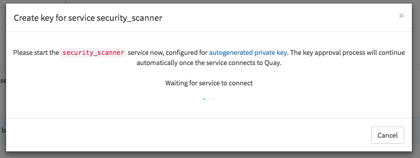

# Quay Security Scanner

Quay Enterprise supports scanning container images for known vulnerabilities with a scanning engine such as [Clair](clair.md). This document explains how to configure Clair with Quay Enterprise.

## Visit the management panel

Sign in to a super user account and visit `http://yourregister/superuser` to view the management panel:

## Enable Security Scanning

- Click the configuration tab () and scroll down to the section entitled **Security Scanner**.
- Check the "Enable Security Scanning" box

## Enter a security scanner

In the "Security Scanner Endpoint" field, enter the HTTP endpoint of a Quay Enterprise-compatible security scanner such as [Clair](clair.md).

## Generate an auth key

To connect Quay Enterprise securely to the scanner, click "Create Key >" to create an authentication key between Quay and the Security Scanner.

### Authentication for high-availability scanners

If the security scanning engine is running on multiple instances in a high-availability setup, select "Generate shared key":

Enter an optional expiration date, and click "Generate Key":

**Save the key ID and download the preshared private key into the configuration directory for the security scanning engine.**

### Authentication for single-instance scanners

If the security scanning engine is being run on a single instance, select "Have the service provide a key":

Once the following dialog is visible, run the security scanning engine:

When the security scanning engine connects, the key will be automatically approved.

## Save configuration

- Click "Save Configuration Changes"
- Restart the container (you will be prompted)
