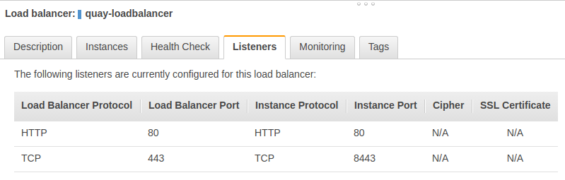
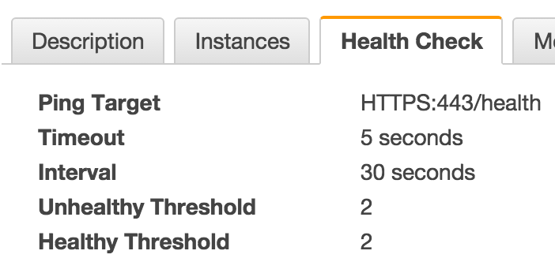
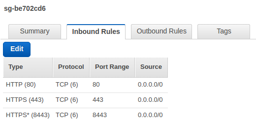

#Running Quay Enterprise behind an Elastic Load Balancer

Running Quay Enterprise behind a load balancer is often desired for large installations. However, simply putting a load balancer in front of the Quay Enterprise has some unintended consequences:

*   all logged IP addresses will be the IP of the load balancer
*   since the TLS-termination is done by the container, you can’t use both a load balancer and HTTPS.

These issues can be avoided through the use of [Proxy Protocol](http://www.haproxy.org/download/1.5/doc/proxy-protocol.txt) which is exposed by the container on **port 8443**. This requires the Quay Enterprise container be executed the with the `-p 8443:8443` flag on the `docker run` command to expose this port:

```
sudo docker run --restart=always -p 443:443 -p 80:80 -p 8443:8443 --privileged=true -v /local/path/to/the/config/directory:/conf/stack -v /local/path/to/the/storage/directory:/datastorage -d quay.io/coreos/quay
```

Load balancer requirements include:

* TCP Forwarding
* Proxy Protocol forwarding

| Software | TCP Forwarding | Proxy Protocol |
| -------- | :------------: | :------------: |
| HAProxy  |       ✓        |       ✓        |
| ELB      |       ✓        |       ✓        |
| nginx    |       ✓        |       ✕        |

## Setting up Amazon Elastic Load Balancer

Setting up an ELB with Proxy Protocol enabled requires an existing classic ELB and access to the [aws cli tool](http://docs.aws.amazon.com/cli/latest/userguide/cli-chap-getting-started.html). AWS documentation on creating an ELB can be found [here](http://docs.aws.amazon.com/elasticloadbalancing/latest/classic/elb-getting-started.html).

ELB Name: `quay-loadbalancer` 

Policy Name: `quay-ProxyProtocol-policy`

### Create a load balancer policy that enables the Proxy Protocol 

```
$ aws elb create-load-balancer-policy --load-balancer-name quay-loadbalancer --policy-name quay-ProxyProtocol-policy --policy-type-name ProxyProtocolPolicyType --policy-attributes AttributeName=ProxyProtocol,AttributeValue=true
```

Describe the `quay-ProxyProtocol-policy`  policy to ensure correctness. 

```
$ aws elb describe-load-balancer-policies --load-balancer-name quay-loadbalancer --policy-names quay-ProxyProtocol-policy
```

Output should match the following: 

```
{
    "PolicyDescriptions": [
        {
            "PolicyName": "quay-ProxyProtocol-policy",
            "PolicyAttributeDescriptions": [
                {
                    "AttributeName": "ProxyProtocol",
                    "AttributeValue": "true"
                }
            ],
            "PolicyTypeName": "ProxyProtocolPolicyType"
        }
    ]
}
```

### Set the Proxy Protocol policy on instance port 8443

```
$ aws elb set-load-balancer-policies-for-backend-server --load-balancer-name quay-loadbalancer --instance-port 8443 --policy-names quay-ProxyProtocol-policy
```

### View configuration of ELB

Confirm that the Proxy Protocol policy has  been set to on instance port 8443 by looking for the output of `BackendServerDescriptions` in the ELB description: 

```
$ aws elb describe-load-balancers --load-balancer-name quay-loadbalancer
[...]
{
    "LoadBalancerDescriptions": [
        {
            ...
            "BackendServerDescriptions": [
                {
                    "PolicyNames": [
                        "quay-ProxyProtocol-policy"
                    ],
                    "InstancePort": 8443
                    ]
                }
            ], 
            ...
        }
    ]
}
```


### Configure listeners to forward traffic to Quay Enterprise

A TCP listener should be configured to route traffic from Load Balancer Port 443 to Instance Port 8443. This is most easily configured from the AWS console. 


When properly configured, the Listeners tab for the ELB should appear like so:



### Add Health Check 

After the listeners have been configured, the health checking endpoint needs to be configured to use the previously unused port 443. When properly configured, the Listeners tab for the ELB should appear like so:



### Check Functionality 

If the ELB with Proxy Protocol is functioning properly curling the `/v1/_ping` endpoint should return `true`. Replace ${LoadBalancer} with the `A` record of the quay-loadbalancer ELB..

```
$ curl -k https://${LoadBalancer}/v1/_ping
true
```

`docker login` and `docker push` should be operational. 

## Troubleshooting 

[Security group](http://docs.aws.amazon.com/AWSEC2/latest/UserGuide/using-network-security.html) settings are often the culprit if the ELB is not resolving but the health check reports the instance as in service. Misconfiguration of the security group generally shows up as the connection to the ELB hanging during requests.

The security group for the ELB should be open for inbound traffic from port `80`, `443`, and `8443`. 




Setting new ELB policy occasionally requires removing and reassociating the instance for the policy to be applied. 
