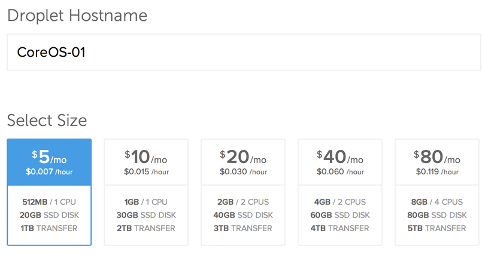

# Running CoreOS on DigitalOcean

## Choosing a Channel

CoreOS is designed to be [updated automatically][update-docs] with different
schedules per channel. You can [disable this feature][reboot-docs], although we
don't recommend it. Read the [release notes][release-notes] for specific
features and bug fixes.

The following command will create a single droplet. For more details, check out
<a href="#via-the-api">Launching via the API</a>.

<div id="do-images">
  <ul class="nav nav-tabs">
    <li><a href="#stable" data-toggle="tab">Stable Channel</a></li>
    <li><a href="#beta" data-toggle="tab">Beta Channel</a></li>
    <li class="active"><a href="#alpha" data-toggle="tab">Alpha Channel</a></li>
  </ul>
  <div class="tab-content coreos-docs-image-table">
    <div class="tab-pane active" id="alpha">
      <div class="channel-info">
        <p>The alpha channel closely tracks master and frequently has new releases. The newest versions of <a href="{{site.url}}/using-coreos/docker">docker</a>, <a href="{{site.url}}/using-coreos/etcd">etcd</a>, and <a href="{{site.url}}/using-coreos/clustering">fleet</a> will be available for testing. Current version is CoreOS {{site.data.alpha-channel.do-version}}.</p>
        <a href="https://cloud.digitalocean.com/droplets/new?image=coreos-alpha" class="btn btn-default">Launch CoreOS Droplet</a><br/><br/>
        <p>Launch via DigitalOcean API by specifying <code>$REGION</code>, <code>$SIZE</code> and <code>$SSH_KEY_ID</code>:</p>
        <pre>curl --request POST "https://api.digitalocean.com/v2/droplets" \
     --header "Content-Type: application/json" \
     --header "Authorization: Bearer $TOKEN" \
     --data '{"region":"'"${REGION}"'",
        "image":"{{site.data.alpha-channel.do-image-path}}",
        "size":"'"$SIZE"'",
        "user_data": "'"$(cat ~/cloud-config.yaml)"'",
        "ssh_keys":["'"$SSH_KEY_ID"'"],
        "name":"core-1"}'</pre>
      </div>
    </div>
    <div class="tab-pane" id="beta">
      <div class="channel-info">
        <p>CoreOS on DigitalOcean is new! There haven't been any beta images yet.</p>
        <p>Alpha images can be <a href="{{site.url}}/docs/cluster-management/setup/switching-channels">switched</a> to the beta channel.</p>
      </div>
    </div>
    <div class="tab-pane" id="stable">
      <div class="channel-info">
        <p>CoreOS on DigitalOcean is new! There haven't been any stable images yet.</p>
        <p>Alpha images can be <a href="{{site.url}}/docs/cluster-management/setup/switching-channels">switched</a> to the stable channel.</p>
      </div>
    </div>
  </div>
</div>

[update-docs]: {{site.url}}/using-coreos/updates
[reboot-docs]: {{site.url}}/docs/cluster-management/debugging/prevent-reboot-after-update
[release-notes]: {{site.url}}/releases

## Cloud-Config

CoreOS allows you to configure machine parameters, launch systemd units on
startup, and more via cloud-config. Jump over to the [docs to learn about the
supported features][cloud-config-docs]. Cloud-config is intended to bring up a
cluster of machines into a minimal useful state and ideally shouldn't be used
to configure anything that isn't standard across many hosts. Once a droplet is
created on DigitalOcean, the cloud-config cannot be modified.

You can provide raw cloud-config data to CoreOS via the DigitalOcean web
console or <a href="#via-the-api">via the DigitalOcean API</a>.

The most common cloud-config for DigitalOcean looks like:

```yaml
#cloud-config

coreos:
  etcd:
    # generate a new token for each unique cluster from https://discovery.etcd.io/new
    discovery: https://discovery.etcd.io/<token>
    # multi-region deployments, multi-cloud deployments, and droplets without
    # private networking need to use $public_ipv4
    addr: $private_ipv4:4001
    peer-addr: $private_ipv4:7001
  units:
    - name: etcd.service
      command: start
    - name: fleet.service
      command: start
```

The `$private_ipv4` and `$public_ipv4` substitution variables are fully
supported in cloud-config on DigitalOcean. In order for `$private_ipv4` to be
populated, the droplet must have private networking enabled.

[do-cloud-config]: https://developers.digitalocean.com/#droplets
[cloud-config-docs]: {{site.url}}/docs/cluster-management/setup/cloudinit-cloud-config

### Adding More Machines
To add more instances to the cluster, just launch more with the same
cloud-config. New instances will join the cluster regardless of region.

## Launching Droplets

### Via the API

For starters, generate a [Personal Access Token][do-token-settings] and save it
in an environment variable:

```sh
read TOKEN
# Enter your Personal Access Token
```

Upload your SSH key via [DigitalOcean's API][do-keys-docs] or the web console.
Retrieve the SSH key ID via the ["list all keys"][do-list-keys-docs] method:

```sh
curl --request GET "https://api.digitalocean.com/v2/account/keys" \
     --header "Authorization: Bearer $TOKEN"
```

Save the key ID from the previous command in an environment variable:

```sh
read SSH_KEY_ID
# Enter your SSH key ID
```

Create a 512MB droplet with private networking in NYC3 from the CoreOS Alpha
image:

```sh
curl --request POST "https://api.digitalocean.com/v2/droplets" \
     --header "Content-Type: application/json" \
     --header "Authorization: Bearer $TOKEN" \
     --data '{
      "region":"nyc3",
      "image":"{{site.data.alpha-channel.do-image-path}}",
      "size":"512mb",
      "name":"core-1",
      "private_networking":true,
      "ssh_keys":['$SSH_KEY_ID'],
      "user_data": "'"$(cat cloud-config.yaml)"'"
}'

```

For more details, check out [DigitalOcean's API documentation][do-api-docs].

[do-api-docs]: https://developers.digitalocean.com/#droplets
[do-keys-docs]: https://developers.digitalocean.com/#keys
[do-list-keys-docs]: https://developers.digitalocean.com/#list-all-keys
[do-token-settings]: https://cloud.digitalocean.com/settings/applications

### Via the Web Console

1. Open the "<a href="https://cloud.digitalocean.com/droplets/new?image=coreos-alpha">new droplet</a>"
   page in the web console.
2. Give the machine a hostname, select the size, and choose a region.<br/><br/>
<div class="row">
  <div class="col-lg-8 col-md-10 col-sm-8 col-xs-12">
    
    <div class="caption">Choosing a CoreOS channel</div>
  </div>
</div>
3. Enable User Data and add your cloud-config in the text box.<br /><br />
<div class="row">
  <div class="col-lg-8 col-md-10 col-sm-8 col-xs-12">
    
    <div class="caption">Droplet settings for networking and cloud-config</div>
  </div>
</div>
4. Choose your <a href="#choosing-a-channel">preferred channel</a> of CoreOS.<br/><br/>
<div class="row">
  <div class="col-lg-8 col-md-10 col-sm-8 col-xs-12">
    
    <div class="caption">Choosing a CoreOS channel</div>
  </div>
</div>
5. Select your SSH keys.

Note that DigitalOcean is not able to inject a root password into CoreOS images
like it does with other images. You'll need to add your keys via the web
console or add keys or passwords via your cloud-config in order to log in.

## Using CoreOS

Now that you have a machine booted it is time to play around.
Check out the [CoreOS Quickstart][quick-start] guide or dig into
[more specific topics][docs].

[quick-start]: {{site.url}}/docs/quickstart
[docs]: {{site.url}}/docs
