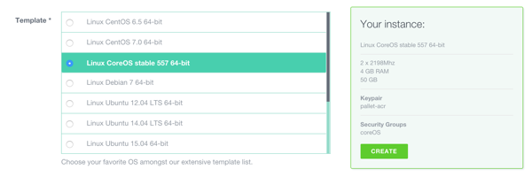
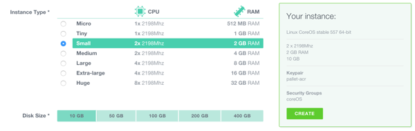
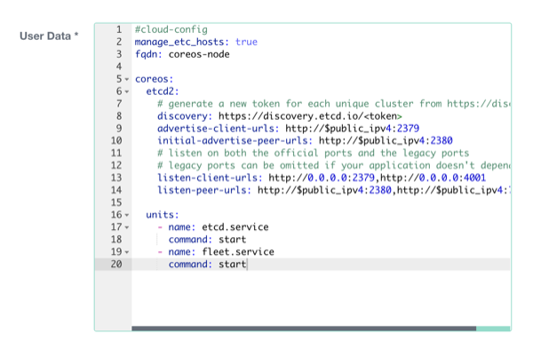

# Running CoreOS on Exoscale

## Choosing a Channel

CoreOS is designed to be [updated automatically][update-docs] with different
schedules per channel. You can [disable this feature][reboot-docs], although we
don't recommend it. Read the [release notes][release-notes] for specific
features and bug fixes.

The Exoscale CoreOS image is built officially and each CoreOS instance deployment
is a unique fresh instance. By default, only stable channel are deployed on
Exoscale, you can easily [switch to Beta or Alpha channel][switching-channels].


[update-docs]: {{site.baseurl}}/using-coreos/updates
[reboot-docs]: {{site.baseurl}}/docs/cluster-management/debugging/prevent-reboot-after-update
[switching-channels]: {{site.baseurl}}/docs/cluster-management/setup/switching-channels
[release-notes]: {{site.baseurl}}/releases
[cloud-config-docs]: {{site.baseurl}}/docs/cluster-management/setup/cloudinit-cloud-config

## Security Groups

Unlike other providers, all Exoscale instances are protected by default on inbound traffic.
In order to be able to work in a CoreOS cluster you should add the following rules in 
either your default security group or a security group of your choice and tag all 
CoreOS instances with it:

* SSH: TCP port 22
* Etcd2: TCP ports 2379 for client communication and 2380 for server-to-server communication
* Etcd (Deprecated): TCP ports 4001 for client communication and 7001 for server-to-server communication


## Cloud-Config

CoreOS allows you to configure machine parameters, launch systemd units on
startup, and more via cloud-config. Jump over to the [docs to learn about the
supported features][cloud-config-docs]. Cloud-config is intended to bring up a
cluster of machines into a minimal useful state and ideally shouldn't be used
to configure anything that isn't standard across many hosts. 
Once the machine is created, cloud-config cannot be modified.

You can provide raw cloud-config data to CoreOS via the Exoscale portal 
or <a href="#via-the-api">via the Exoscale compute API</a>.

The default cloud-config configuration on all Exoscale instances specifies
hostname:

```yaml
#cloud-config
manage_etc_hosts: true
fqdn: coreos-node
```
In order to leverage CoreOS unique automation attributes, a standard 
CoreOS cloud-config on Exoscale could be configured with:

```yaml
#cloud-config
manage_etc_hosts: true
fqdn: coreos-node

coreos:
  etcd2:
    # generate a new token for each unique cluster from https://discovery.etcd.io/new?size=3
    # specify the initial size of your cluster with ?size=X
    discovery: https://discovery.etcd.io/<token>
    advertise-client-urls: http://$public_ipv4:2379,http://$private_ipv4:4001
    initial-advertise-peer-urls: http://$public_ipv4:2380
    # listen on both the official ports and the legacy ports
    # legacy ports can be omitted if your application doesn't depend on them
    listen-client-urls: http://0.0.0.0:2379,http://0.0.0.0:4001
    listen-peer-urls: http://$public_ipv4:2380

  units:
    - name: etcd2.service
      command: start
    - name: fleet.service
      command: start
```

### Adding More Machines
To add more instances to the cluster, just launch more with the same
cloud-config adjusting the FQDN or removing the statement. 
New instances will join the cluster regardless of location
provided that security groups are correctly configured.

### Modifying cloud-config
It is possible to modify the cloud-config contents during the lifetime
of an instance. In order to modify the contents, you need to use
the API command `updateVirtualMachine` with the machine in a stopped
state.

```sh
cs stopVirtualMachine id=<UUID of instance>
cs updateVirtualMachine id=<UUID of instance> userData=<base64 encoded value of your cloud-config>
cs startVirtualMachine id=<UUID of instance>
```

*note:* switch the request type from GET to POST if the userData
payload is longer than 2KB.

[API reference for updateVirtualMachine](https://community.exoscale.ch/compute/api/#updatevirtualmachine_GET)

## SSH to your CoreOS instances

CoreOS does not allow root connection to the instance. By default, it uses the `core` user 
instead of `root` and doesn't use a password for authentication. You'll need to 
add an SSH key(s) via the web console or add keys/passwords via your cloud-config in order to log in.

To log in to a CoreOS instance after it's created click on its IP address or run:

```sh
ssh core@<ip address>
```

Optionally, you may want to [configure your ssh-agent]({{site.baseurl}}/docs/launching-containers/launching/fleet-using-the-client/#remote-fleet-access) to more easily run [fleet commands]({{site.baseurl}}/docs/launching-containers/launching/launching-containers-fleet/).

## Launching instances

### Via the API

Install and configure the command line client (Python required) with
your <a href="https://portal.exoscale.ch/account/profile/api">API details</a> 


```sh
pip install cs
vi $HOME/.cloudstack.ini
[cloudstack]
endpoint = https://api.exoscale.ch/compute
key = api key
secret = secret
```

To launch a Small 2GB instance with the current Stable CoreOS image:

note: template ids are available on <a href="https://www.exoscale.ch/open-cloud/templates/">Exoscale website</a>

```sh
cs deployVirtualMachine templateId=2a196b89-0c50-4400-9d42-ef43bcc0fa99 serviceOfferingId=21624abb-764e-4def-81d7-9fc54b5957fb zoneId=1128bd56-b4d9-4ac6-a7b9-c715b187ce11 keyPair=[keypair name]
```

Be sure to specify your SSH key to be able to access the machine. Management of 
SSH keys is detailed on the [SSH key page][exo-keys-docs].
For more details, check out [Exoscale's API documentation][exo-api-docs].

[exo-api-docs]: https://community.exoscale.ch/compute/api/
[exo-keys-docs]: https://community.exoscale.ch/compute/documentation/#SSH_keypairs

### Via the Web Console

1. Open the "<a href="https://portal.exoscale.ch/compute/instances/add">add new instance</a>"
   page in the Exoscale web portal.
2. Give the machine a hostname, and choose a zone.<br/><br/>
3. Choose the CoreOS template
<div class="row">
  <div class="col-lg-8 col-md-10 col-sm-8 col-xs-12">
    
    <div class="caption">Choosing Exoscale template</div>
  </div>
</div>
4. Choose the instance size
<div class="row">
  <div class="col-lg-8 col-md-10 col-sm-8 col-xs-12">
    
    <div class="caption">Choosing Exoscale instance size</div>
  </div>
</div>
5. Select your SSH keys.
6. Add your your optional cloud-config.<br /><br />
<div class="row">
  <div class="col-lg-8 col-md-10 col-sm-8 col-xs-12">
    
    <div class="caption">Exoscale cloud-config</div>
  </div>
</div>
7. Create your instance

Unlike other Exoscale images where the root password is randomly set 
at startup, CoreOS does not have password logon activated. You will need to
[configure your public key with Exoscale][exo-keys-docs] in order to login to the CoreOS
instances or to specify external keys using cloud-config.

## Using CoreOS

Now that you have a machine booted it is time to play around.
Check out the [CoreOS Quickstart][quick-start] guide or dig into
[more specific topics][docs].

[quick-start]: {{site.baseurl}}/docs/quickstart
[docs]: {{site.baseurl}}/docs
